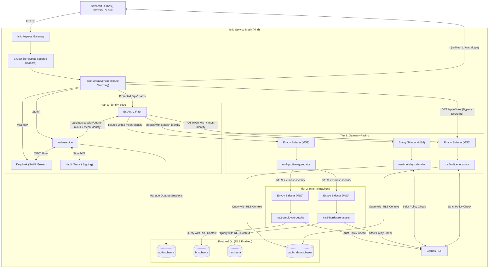

# Design Doc: Istio Security POC (Domain & Tech Stack)

**Date:** 2026-05-12
**Status:** Current Architecture
**Domain:** HR Employee Directory
**Goal:** A production-inspired, locally deployable Zero-Trust architecture featuring an Istio Ingress Gateway, Keycloak-based human IAM with SAML identity brokering, a custom Python `auth-service` acting as the auth edge, PostgreSQL-backed opaque browser sessions, bearer-token support for API clients, Vault Transit-backed signing for short-lived internal identity assertions, edge-of-pod legacy header translation, multi-tiered workload isolation with strict mTLS, API composition, Cerbos-based fine-grained authorization, PostgreSQL row-level security, and Python-driven response masking.

## 1. Background & Requirements

### The Problem

In a realistic enterprise environment, microservices have varying levels of exposure. Some act as public-facing aggregators, while others should never be reachable from outside the mesh. Legacy services may also expect different application-specific identity headers, making mass code changes risky during migration. Relying on application code alone for login, authorization, and data masking creates a fragile trust model: forged headers can leak identity context, compromised services can overreach laterally, sensitive columns can be exposed even when the caller should only see a partial view, and browser-oriented identity protocols can accidentally leak into business services that should only consume normalized internal identity.

### The Requirement

Create a multi-tiered HR Directory architecture with 5 domain microservices (MS1 - MS5), supporting security services, and a shared database that enforces:

1. **Centralized Edge Ingress:** All external traffic enters through one Istio Ingress Gateway. In the local `kind` deployment, hostname-based routing exposes `app.localtest.me` for `/auth/*` and `/api/*` traffic and `idp.localtest.me` for the limited Keycloak public protocol surface.
2. **Header Spoofing Defense:** A pre-strip `EnvoyFilter` removes any incoming `x-platform-*`, `x-role-*`, `x-mesh-identity`, and known application-specific identity headers from the outside world before authorization or routing. Istio workload identity and `AuthorizationPolicy` then decide which workloads are allowed to communicate.
3. **Human Authentication & Session Management:** `Keycloak` is the human identity provider for account lifecycle, login, SAML identity brokering, and coarse role assignment. A custom Python `auth-service` handles `/auth/*`, performs the OIDC authorization-code flow with Keycloak, validates opaque browser sessions or bearer tokens, and acts as the `ExtAuthz` provider for protected business routes.
4. **SAML Support Through Keycloak:** SAML is supported at the human identity boundary by configuring Keycloak as a broker to an external enterprise SAML IdP. `auth-service` and the business services do not parse SAML assertions; they consume normalized Keycloak identity.
5. **Browser and API Auth Modes:** Browsers receive an opaque `HttpOnly`, `Secure`, `SameSite` session cookie backed by PostgreSQL. API clients and curl use `Authorization: Bearer <token>`. Bearer tokens are not stored directly in browser cookies.
6. **Short-Lived Signed Internal Identity:** For every authorized protected request, `auth-service` mints a short-lived JWT/JWS-style mesh assertion in a fixed header, `x-mesh-identity`. The payload contains user identity, coarse roles, audience, delegation context, issuance time, expiry, nonce, issuer, and Vault key version. Vault Transit signs it using an asymmetric key.
7. **Legacy Header Compatibility:** The canonical platform identity inside the mesh is `x-mesh-identity`. Per-service inbound sidecar filters project that trusted identity into the legacy headers each application already understands, such as `x-ms1-user`, `x-ms2-role`, or service-specific equivalents. The application-specific headers are compatibility outputs, not the root security proof.
8. **Tiered Routing & Workload Trust:**
   * **Tier 1 (Publicly Routable):** `ms1-profile-aggregator`, `ms4-holiday-calendar`, and `ms5-office-locations` receive traffic from the Gateway. `ms1-profile-aggregator` is the aggregator/BFF layer.
   * **Tier 2 (Internal Backend):** `ms2-employee-details` and `ms3-hardware-assets` only accept traffic from `ms1-profile-aggregator`.
   * **Tier 3 (Database):** A shared PostgreSQL database with strict schema segregation (`auth`, `hr`, `it`, `public_data`) only accepts traffic from the allowed service identities plus a one-time `db-seeder` job.
9. **Coarse + Fine Authorization:** Coarse route and role checks happen at the edge through `ExtAuthz` before requests reach Python business logic. Fine-grained business rules (for example, "a manager can only view direct reports") and response masking directives are delegated to `Cerbos`.
10. **Row Filtering + Column Masking:** PostgreSQL row-level security (RLS) is the final hard guard for which rows can ever be visible. It does not duplicate every Cerbos business rule; Cerbos decides business permission and masking, RLS enforces non-bypassable row visibility, and Python applies the final field transformations.
11. **Zero-Trust Network:** All pod-to-pod and pod-to-database communication is encrypted with strict Istio mTLS, and service-to-service reachability is explicitly controlled with `AuthorizationPolicy`.
12. **Local-First Deployment:** Every component in the architecture must be deployable in a local `kind` cluster with open-source components only: Istio Ingress Gateway, Keycloak, Vault, Cerbos, PostgreSQL, and the FastAPI services.

---

## 2. Technology Stack

* **Frontend UI:** Python + Streamlit running as a local process on the host machine (outside the cluster), calling the public API through the Istio Ingress Gateway at `https://app.localtest.me`. Accessible at `https://app.localtest.me:8501`.
* **Human IAM:** Keycloak for user registration, login, group/role assignment, OIDC token issuance, and SAML identity brokering to an external enterprise IdP.
* **Auth Edge:** Python + FastAPI `auth-service` for OIDC callback handling, PostgreSQL-backed opaque session validation, bearer-token validation, `ExtAuthz` decisions, internal mesh-token minting, and JWKS publication.
* **Key Management:** Vault Transit for asymmetric signing and key rotation/versioning of the `x-mesh-identity` token.
* **Fine-Grained Authorization:** Cerbos as the central Policy Decision Point (PDP) for resource-level and field-level authorization outputs.
* **Backend Services:** Python + FastAPI + `uvicorn` (ASGI server). `ms1-profile-aggregator` uses `httpx` for concurrent calls to MS2/MS3.
* **Database:** PostgreSQL, deployed inside the mesh, using schema segregation, PostgreSQL-backed auth sessions, and row-level security policies.
* **Testing:** `pytest` and FastAPI's `TestClient` for unit and integration testing.
* **Infrastructure:** Kubernetes (`kind`), Istio Service Mesh, Istio Ingress Gateway, `VirtualService`, `EnvoyFilter` for header stripping and legacy header projection, `ExtAuthz`, and `AuthorizationPolicy`.

---

## 3. Architecture & Components

### Component Diagram



### 3.1 The Edge (Gateway, Keycloak, Auth Edge, and Vault)

* **Ingress Gateway:** Exposes one local entry point from the `kind` cluster. Hostname routing separates application traffic from identity-provider traffic:
    1. `app.localtest.me` routes `/auth/*` to `auth-service` and protected `/api/*` paths to Tier 1 services after `ExtAuthz`.
    2. `idp.localtest.me` routes only the Keycloak public protocol surface needed for browser login, OIDC discovery, SAML brokering, and static login resources: `/realms/*`, `/resources/*`, and `/.well-known/*`.
    3. Keycloak `/admin/*`, `/metrics`, `/health`, and management port `9000` are not publicly routed. Admin and health access can use `kubectl port-forward` during local development.
* **Filter order:** The gateway applies a defensive sequence before routing:
    1. **Pre-strip (`EnvoyFilter`):** Removes externally supplied `x-platform-*`, `x-role-*`, `x-mesh-identity`, and known service-specific identity headers.
    2. **`ExtAuthz` policy:** Applies only to protected business paths, not to `/auth/*`, Keycloak protocol paths, JWKS, or health endpoints. This avoids authentication loops.
    3. **Router filter (`VirtualService`):** Sends allowed traffic to the correct service after identity context has been established.
* **`auth-service` (custom auth edge):** A FastAPI service deployed inside the mesh and used in two ways:
    1. **Direct route target for `/auth/*`:** Handles login start, OIDC callback, logout, CSRF validation for browser auth actions, and PostgreSQL-backed opaque session establishment.
    2. **`ExtAuthz` provider for protected routes:** Accepts either an opaque browser session cookie or an `Authorization: Bearer` token from API clients, validates the identity with Keycloak/session state, performs coarse route/method/role checks, and returns `ALLOW` or `DENY`.
* **Keycloak:** The system of record for human identity. It manages account lifecycle, login, realm/client roles such as `employee`, `manager`, `hr_admin`, and `it_admin`, and SAML federation to an external enterprise IdP. Keycloak normalizes SAML-brokered users into the same OIDC/session identity model consumed by `auth-service`.
* **Vault Transit:** Holds the asymmetric signing key used for the internal mesh assertion. `auth-service` sends a canonical short-lived token payload to Vault Transit, receives a signature, assembles the final JWS/JWT, and publishes a JWKS endpoint derived from the active public keys so services can verify tokens locally.
* **Injected Mesh Header:** On successful authorization, `auth-service` adds a short-lived `x-mesh-identity` header to the upstream request. The payload includes:
    * `iss` - issuer, fixed to `auth-service`
    * `sub` - user identity (for example `user:alice`)
    * `roles` - coarse roles from Keycloak
    * `groups` or `department` - optional principal attributes
    * `aud` - intended workload audience
    * `azp` - authorized party, fixed to the gateway/auth edge path
    * `act` - actor/delegation context, for example MS1 calling MS2 for Alice
    * `iat` / `exp` - issuance and short expiry
    * `jti` - nonce/request identifier for replay detection and audit correlation
    * `kid` - Vault key version/public key identifier used for verification

### 3.2 External Authentication Flows

* **Browser session flow:** A browser calls `app.localtest.me`. If the request lacks a valid app session, `auth-service` starts the OIDC authorization-code flow and redirects the browser to `idp.localtest.me`. After Keycloak authenticates the user, possibly by brokering to an external SAML IdP, it returns an OIDC authorization code to `auth-service`. `auth-service` exchanges the code, stores a server-side opaque session in the PostgreSQL `auth` schema, and sets an `HttpOnly`, `Secure`, `SameSite` cookie containing only a random session id.
* **API/curl flow:** API clients use `Authorization: Bearer <token>`. For the final implementation, the preferred interactive CLI path is OAuth Device Authorization Flow so curl does not need to handle passwords directly. A copied short-lived Keycloak access token can be allowed for local demo workflows. Direct Access Grant/password grant should be documented as a local-only shortcut if used at all.
* **Why not bearer-in-cookie:** Browser cookies are sent automatically by the browser, so storing bearer tokens directly in cookies increases CSRF and token-theft blast radius. The browser cookie should be an opaque session reference, while access/refresh tokens remain server-side or are represented only by server-side session state.
* **SAML support boundary:** SAML is intentionally terminated at Keycloak. Neither `auth-service` nor the business services parse SAML assertions. This keeps human identity protocols at the identity-provider boundary and lets business services consume one normalized internal identity format.

### 3.3 Tier 1: Gateway-Facing Services (MS1, MS4, MS5)

* **Role:** These are the gateway-facing application services. `ms1-profile-aggregator` acts as an orchestrator/BFF, `ms4-holiday-calendar` is mostly public data, and `ms5-office-locations` performs CRUD on low-sensitivity shared data.
* **Ingress Trust Boundary:** `AuthorizationPolicy` allows ingress traffic only from the Ingress Gateway workload identity. Even if an engineer misconfigures a route, direct calls from other sources are rejected at the proxy.
* **Legacy Header Projection:** The application does not consume `x-mesh-identity` directly. Its inbound sidecar first strips any pre-existing application-specific identity headers, validates `x-mesh-identity` or consumes the mesh authentication result for it, then projects the canonical claims into the headers that service already expects, such as `x-ms1-user`, `x-ms4-role`, or `x-ms5-user`. This preserves legacy service contracts while still giving the platform one canonical internal identity format.
* **MS1 Aggregation Flow:** When MS1 receives `/api/profile/{id}`, it consumes its normal application-specific headers and fans out concurrently to MS2 and MS3. The sidecar/platform layer forwards the short-lived `x-mesh-identity` assertion alongside the internal calls so downstream services can perform the same trust checks and legacy header projection.
* **Delegation Guardrail:** Downstream services do not trust application-specific headers as security proof. MS2/MS3 require both a valid token audience/delegation context and an Istio source principal matching MS1. This prevents a valid user token or projected legacy header from becoming a general-purpose credential inside the mesh.
* **POC Scope Decision:** Header projection is intentionally kept at the pod boundary rather than forcing every migrated application to rename headers or learn OIDC/SAML/Keycloak/Vault details. The platform owns canonical identity; applications keep their local header contract.

### 3.4 Tier 2: Internal Backend Services (MS2, MS3)

* **Role:** These are secure backend database interfaces. `ms2-employee-details` fronts the HR schema, and `ms3-hardware-assets` fronts the IT schema.
* **Workload Isolation:** `AuthorizationPolicy` allows Tier 2 traffic only from `ms1-profile-aggregator`. External clients and the Ingress Gateway do not have direct routes to MS2/MS3, and the sidecars reject unexpected callers even if a route is created by mistake.
* **Two-Part Trust Check:** Tier 2 services only process a request when both checks pass:
    1. Istio mTLS proves the caller workload identity is `ms1-profile-aggregator`.
    2. The `x-mesh-identity` token is signed by `auth-service`, not expired, contains a Tier 2-compatible `aud`, and includes an `act` claim showing the delegated MS1 call context.
* **Header Replay Resistance:** A stolen or accidentally forwarded `x-mesh-identity` header is not sufficient if it comes from the wrong workload principal. A projected header such as `x-ms2-user` is even weaker by itself and is treated only as an application compatibility header. A legitimate MS1 caller is still limited by token expiry, `aud`, `jti`, Cerbos decisions, and database row visibility.
* **Policy Evaluation Pattern:** Before executing the main data query, a Tier 2 service:
    1. Receives legacy-compatible headers produced by the inbound sidecar from verified mesh identity
    2. Performs a lightweight metadata lookup if needed (for example `manager_id`, `department`, or sensitivity classification for the target record)
    3. Calls Cerbos with principal attributes derived from the trusted mesh identity plus resource attributes from the metadata lookup
    4. Interprets the Cerbos result as `ALLOW`/`DENY` plus outputs such as masking mode or visible field sets
* **Defense in Depth:** Cerbos answers "should this business action be allowed, and what should the response look like?", but PostgreSQL RLS remains the final technical control for which rows can ever be visible. RLS should not try to duplicate every Cerbos condition; it is the non-bypassable row-visibility guard if policy logic or application code is wrong.

### 3.5 Tier 3: Shared Database Layer

* **Role:** Central PostgreSQL data store deployed inside the mesh.
* **Schema Segregation:** The database remains split into `auth`, `hr`, `it`, and `public_data` schemas. Service accounts map to least-privilege database roles:
    * `auth-service` -> `auth`
    * `ms2-employee-details` -> `hr`
    * `ms3-hardware-assets` -> `it`
    * `ms4-holiday-calendar` and `ms5-office-locations` -> `public_data`
    * End users never receive direct database credentials.
* **PostgreSQL-Backed Sessions:** Browser sessions are stored as opaque records in the `auth` schema. The browser cookie contains only a random session id, while the server-side record stores the user id, Keycloak session/token metadata needed for validation, expiry, rotation state, last-seen timestamp, and revocation status. The `auth-service` database role can access this schema but cannot read HR or IT tables.
* **Istio AuthorizationPolicy:** Traffic on port `5432` is allowed only from the expected service principals plus the one-time `db-seeder` job. `ms1-profile-aggregator` and external callers cannot connect directly to PostgreSQL.
* **RLS Safety Rules:** Protected tables must enable RLS, and sensitive tables should use `FORCE ROW LEVEL SECURITY` where practical. Service runtime roles must not own protected tables and must not have the `BYPASSRLS` attribute. Table-owner or migration roles are reserved for initialization/migrations and are not used by the running services.
* **RLS Context Propagation:** Each service opens a transaction and sets transaction-local context from the trusted identity context, not from caller-supplied raw headers, for example:
    * `SET LOCAL app.current_user_id = 'alice';`
    * `SET LOCAL app.current_roles = 'manager';`
    * `SET LOCAL app.request_id = '<trace-id>';`
  PostgreSQL RLS policies read these settings via `current_setting(...)` to enforce row visibility.
* **Connection Pooling Rule:** Context is transaction-local, not connection-global. Services must set RLS context inside the same transaction as the protected query and must not use session-level `SET` values that can leak across pooled connections.
* **RLS Scope:** RLS protects the hard row boundary: self, direct-report set, department boundary, tenant boundary, or other coarse row-visibility invariant. It should not become a second copy of every Cerbos policy branch, because duplicated policy logic tends to drift.
* **Masking Strategy:** RLS protects rows, not final response shape. Cerbos owns masking decisions and the Python service applies the final field transformations. A stronger future variant can move more masking into SQL views or trusted functions so raw values never leave PostgreSQL unless explicitly permitted.

### 3.6 Centralized Authorization and Data Masking

* **Coarse Auth (Edge):** `auth-service` uses Keycloak session/token data plus route metadata to perform coarse user-to-route checks before the request hits application code.
* **Fine Auth (Cerbos):** Cerbos runs as a central PDP service for the local POC. This is simpler and lighter than a sidecar-per-service model, while still showing a real central policy decision point. It evaluates richer business policies based on both principal and resource context, for example:
    * `manager` can view only direct reports
    * `employee` can view only self
    * `hr_admin` can view all employee rows
    * `it_admin` can manage hardware assets but not HR salary fields
* **Cerbos Outputs:** Cerbos is also the source of masking directives or field-visibility hints that the application interprets, for example:
    * `mask_profile = manager_view`
    * `visible_fields = ["name", "title", "salary_band"]`
    * `omit_fields = ["ssn", "home_address"]`
* **Python Masking Layer:** The application converts Cerbos outputs into concrete transformations, such as:
    * delete `ssn`
    * replace exact `salary` with `salary_band`
    * truncate serial numbers
    * omit personal contact details
* **Important Boundary:** Keycloak roles are not treated as direct table or column permissions. Instead:
    * Keycloak supplies coarse principal identity
    * Cerbos evaluates business permission and field-level/masking policy
    * PostgreSQL enforces hard row-level safety without duplicating every Cerbos rule
    * Python applies the final response masking
* **Policy Failure Behavior:** HR and IT routes fail closed if Cerbos is unavailable or returns an invalid decision. Low-sensitivity public-data routes can have an explicit allowlist for read-only behavior, but that exception must be documented per route.

### 3.7 Failure Modes and Security Defaults

* **`auth-service` unavailable:** Protected `/api/*` routes deny by default because `ExtAuthz` cannot establish identity. Public Keycloak protocol routes and explicitly public health endpoints remain separate from protected business routes.
* **Invalid browser session or bearer token:** `auth-service` denies the request and does not mint `x-mesh-identity`.
* **Vault unavailable during signing:** Protected business requests fail closed. The system does not fall back to unsigned headers or locally held private keys.
* **JWKS temporarily unavailable:** The validating sidecar or service component can continue verifying with a cached public key until the cache TTL expires. Once the cache is stale and refresh fails, protected routes fail closed. Note: Istio must be configured with `PILOT_JWT_ENABLE_REMOTE_JWKS` so that Envoy sidecars fetch the JWKS directly over mTLS, preventing fetch failures when `STRICT` mTLS is enforced.
* **Vault key rotation:** `x-mesh-identity` includes `kid`, mapped to the Vault key version/public key exposed through JWKS. Services retain old public keys until all tokens signed by those keys have expired.
* **Cerbos unavailable:** Sensitive HR and IT decisions deny by default. Any public-data exception must be route-specific and read-only.
* **Missing RLS context:** Protected SQL queries return no rows or raise an application error. They never run with unrestricted default visibility.
* **Audit trail:** Gateway, `auth-service`, Cerbos, Vault, MS1/MS2/MS3, and PostgreSQL session/RLS context all propagate a request id so denied requests can be explained during demos.

### 3.8 End-to-End Request Flow

Summary of a browser request: `GET https://app.localtest.me/api/profile/42`

1. Gateway strips spoofable identity headers.
2. ExtAuthz invokes auth-service → validates session → mints Vault-signed mesh token.
3. Gateway injects `x-mesh-identity` and routes to MS1.
4. MS1 sidecar validates JWT, projects `x-ms1-user/role`, forwards mesh token to MS2/MS3.
5. MS2 sidecar validates JWT + checks source principal + audience/actor claims.
6. MS2 sets RLS context, queries PostgreSQL, checks Cerbos, applies masking, returns sanitized data.
7. MS1 aggregates and returns composite profile.

**For step-by-step detail with sequence diagrams, see [end-to-end-flows.md](components/end-to-end-flows.md).**

---

## 4. Repository Structure

We are utilizing a monorepo structure to house all microservices, frontend UI, testing, and infrastructure manifests.

```text
IstioSecurity/
├── apps/
│   ├── auth-service/            # Custom auth-edge: Keycloak callback, opaque sessions, ExtAuthz, Vault-backed mesh-token minting, JWKS
│   ├── ms1-profile-aggregator/  # FastAPI aggregator/BFF for external profile requests
│   ├── ms2-employee-details/    # FastAPI HR service with Cerbos + RLS-aware data access
│   ├── ms3-hardware-assets/     # FastAPI IT service with Cerbos + RLS-aware data access
│   ├── ms4-holiday-calendar/    # FastAPI public-data service
│   ├── ms5-office-locations/    # FastAPI CRUD service for public office metadata
│   ├── db-seeder/               # Python Job (SQLAlchemy+Faker) to seed employees and relationships
│   └── ui-dashboard/            # Streamlit app (runs locally on host, outside the cluster)
├── db/
│   └── init.sql                 # DDL, schemas, roles, tables, and future RLS policy bootstrap
├── deployment/
│   ├── apps/                    # Deployments & Services (FastAPI apps + Keycloak + Vault + Cerbos + Postgres)
│   ├── networking/              # VirtualServices, Gateway config, EnvoyFilters, ExtAuthz wiring
│   └── security/                # Istio AuthorizationPolicies and related security manifests
├── docs/
│   ├── architecturev2.md        # Current Architecture documentation (Phase 3, revised)
│   ├── plans/                   # Implementation plans and design docs
├── kind/                        # Kind cluster configuration
├── scripts/                     # Automation scripts
└── README.md                    # Main entrypoint and current state documentation
```

---

## 5. Local Deployment Assumptions

This POC is designed for a 48 GB of RAM tested `kind` cluster. It should run with Docker Desktop, Colima, or another compatible container runtime.

* **Expected local resources:** Ensure enough disk for Kubernetes images, app images, and PostgreSQL volumes. The stack is intentionally kept to one PostgreSQL instance, one Keycloak instance, one Vault instance, one Cerbos deployment, one Istio control plane, one ingress gateway, and the FastAPI services.
* **Gateway exposure:** `kind` does not provide a cloud LoadBalancer by default. The preferred local setup is a `kind` cluster config with `extraPortMappings`, for example host `8443` mapped to the ingress gateway HTTPS NodePort. Port-forwarding or `cloud-provider-kind` are acceptable alternatives, but the docs/scripts should choose one path for repeatability.
* **Local hostnames:** Use hostnames that resolve to localhost, such as `app.localtest.me` and `idp.localtest.me`, or document `/etc/hosts` entries. The application and Keycloak should be reached through the same Istio Gateway rather than separate ad hoc service ports.
* **Local TLS:** `mkcert` generates locally-trusted TLS certificates. Running `mkcert -install` adds a local root CA to the system trust store (and NSS for Firefox via `nss`). This means browsers, `curl`, and Python's `requests` library all trust the certs natively — no `--insecure` flags or `verify=False` hacks. Two domains are provisioned: `app.localtest.me` (gateway and UI) and `idp.localtest.me` (Keycloak). The gateway certs are loaded as Kubernetes TLS secrets; the `app.localtest.me` cert is also used directly by Streamlit's built-in TLS server.
* **Local Vault mode:** Vault can run in dev or standalone mode for the POC, but the document must clearly mark that production Vault would need TLS, audit storage, an unseal strategy, backups, upgrade procedures, and stronger operational controls.
* **Local Keycloak exposure:** Public routing should include only `/realms/*`, `/resources/*`, and `/.well-known/*`. Admin, health, metrics, and management endpoints remain private or are accessed through port-forwarding.
* **Local Cerbos mode:** Cerbos runs as a central service for simplicity. A sidecar or DaemonSet model can be discussed as future hardening, but central service mode is the best fit for a local resume demo.

---

## 6. Security Validation Scenarios

The implementation should include repeatable tests or scripts that prove the security claims instead of only showing happy-path traffic.

* **Spoofed external headers:** Send `x-platform-*`, `x-role-*`, `x-mesh-identity`, and app-specific headers such as `x-ms2-user` from outside the cluster and verify the gateway strips them before upstream handling.
* **Unauthenticated protected route:** Call `/api/profile/{id}` without a valid session or bearer token and verify `ExtAuthz` denies the request.
* **Browser login through Keycloak:** Complete login through `app.localtest.me` and `idp.localtest.me`, including a SAML-brokered user path if an external/demo SAML IdP is configured.
* **Curl/API bearer path:** Call a protected API with `Authorization: Bearer <token>` and verify `auth-service` mints the same internal identity format used for browser sessions.
* **Direct Tier 2 access denied:** Attempt to call MS2/MS3 from the gateway, MS4, or a debug pod and verify Istio `AuthorizationPolicy` rejects the request.
* **Wrong workload principal denied:** Replay a valid `x-mesh-identity` from any workload other than MS1 to MS2/MS3 and verify the request fails despite the token being signed.
* **Wrong audience or expired token denied:** Send a signed token with the wrong `aud` or expired `exp` and verify the service rejects it.
* **Legacy header projection:** Send a valid request and verify the application receives only its expected service-specific headers, while raw platform identity headers are not exposed to application code unless explicitly required for that service.
* **MS1 database access denied:** Attempt a direct DB connection from MS1 and verify Istio policy blocks it.
* **RLS denial:** Query an employee outside the caller's hard row-visibility boundary and verify PostgreSQL returns no protected row even if Cerbos or application policy is accidentally permissive.
* **Cerbos masking:** Verify an employee, manager, and HR admin receive different field shapes for the same employee record according to Cerbos outputs.
* **Vault key rotation:** Rotate the Vault Transit key, verify new tokens use the new `kid`, and verify old tokens remain valid only until their short expiry.
* **Fail-closed behavior:** Stop or misconfigure `auth-service`, Vault, JWKS refresh, Cerbos, or RLS context propagation and verify sensitive routes deny instead of returning unprotected data.

---

## 7. Implementation Work Packages and Agent Boundaries

This section is the coordination contract for parallel implementation agents. Agents can work independently as long as they do not change the cross-cutting contracts below without an explicit architecture update.

### 7.1 Global Contracts That Must Not Drift

* **Public hostnames:** `app.localtest.me` is the application/auth/API hostname. `idp.localtest.me` is the Keycloak protocol hostname. Agents must not introduce additional public service hostnames unless the gateway section is updated.
* **Public route ownership:** `/auth/*` belongs to `auth-service`; `/api/profile/{id}` belongs to MS1; `/api/holidays` belongs to MS4; `/api/offices` belongs to MS5; Keycloak public protocol routes are limited to `/realms/*`, `/resources/*`, and `/.well-known/*`.
* **Trusted internal identity header:** `x-mesh-identity` is the only canonical user identity assertion forwarded across the mesh. Agents must not add new platform identity headers for user, role, department, or authorization state.
* **Legacy header boundary:** Service-specific headers such as `x-ms1-user` or `x-ms2-role` may exist only as pod-local compatibility projections produced after platform identity validation. They are not accepted directly from external clients or treated as standalone security proof.
* **External identity boundary:** Keycloak is the only component that handles SAML or external OIDC federation. `auth-service` consumes normalized Keycloak identity; business services consume either platform-validated legacy headers or `x-mesh-identity`, depending on whether that service has been migrated.
* **Browser session model:** Browser cookies contain only an opaque random session id. Bearer/access/refresh tokens are not placed directly in browser cookies.
* **Service-to-service trust model:** A signed mesh token is not enough. Sensitive downstream routes must also be protected by Istio source workload principal checks.
* **Database trust model:** End users never receive database credentials. Runtime service roles are least-privilege roles and do not own protected tables.
* **Policy failure default:** Auth, Vault signing, Cerbos decisions, and RLS context failures deny sensitive business requests rather than returning unprotected data.

### 7.2 Implementation Phases

* **Phase 0 - Contract freeze:** Confirm route names, service accounts, database schema names, token claims, per-service legacy header names, Cerbos resource/action names, RLS row-visibility invariants, and validation scenarios before writing service logic. This prevents agents from inventing incompatible names.
* **Phase 1 - Local platform foundation:** Build the `kind` cluster config, Istio install/profile, namespace layout, gateway exposure, local TLS assumptions, and base Kubernetes manifests. This phase should prove that `app.localtest.me` and `idp.localtest.me` reach the gateway.
* **Phase 2 - Security services foundation:** Deploy Keycloak, Vault, Cerbos, and PostgreSQL. Configure a Keycloak realm, demo users/roles, optional SAML broker metadata, Vault Transit signing key, Cerbos policy storage, and PostgreSQL schemas/roles.
* **Phase 3 - Auth edge:** Implement `auth-service` login/callback/logout/session behavior, bearer-token validation, ExtAuthz contract, Vault-backed mesh-token minting, and JWKS publication.
* **Phase 4 - Shared service security contract:** Implement the shared pod-boundary security behavior for validating `x-mesh-identity`, enforcing expected audience, stripping untrusted service-specific headers, and projecting trusted claims into each service's legacy header contract.
* **Phase 5 - Domain services:** Implement or update MS1-MS5 around the agreed contracts. MS1 owns profile composition. MS2 owns HR data access and masking. MS3 owns hardware data access and masking. MS4/MS5 own public-data reads/writes.
* **Phase 6 - Mesh and database policy enforcement:** Add `PeerAuthentication`, `AuthorizationPolicy`, gateway routing, header stripping, legacy header projection, PostgreSQL RLS policies, and service-account-specific database privileges.
* **Phase 7 - Negative-path validation:** Add scripts/tests that prove denied paths, spoofed headers, wrong audience, wrong workload principal, missing RLS context, Cerbos masking, and Vault rotation behavior.

### 7.3 Work Package Ownership

* **Local platform agent:** Owns `kind` config, Istio installation choices, namespace labels, ingress gateway exposure, local TLS guidance, hostname setup, and base deployment ordering. This agent must not change application routes or token claims.
* **Identity agent:** Owns Keycloak realm setup, demo users, role/group names, OIDC client settings for `auth-service`, and SAML broker configuration. This agent must keep Keycloak admin and management endpoints private.
* **Vault agent:** Owns Vault deployment mode, Transit key creation, signing endpoint configuration, public-key/JWKS export strategy, key-version naming, and audit settings. This agent must not let `auth-service` hold the private signing key locally.
* **Cerbos agent:** Owns policy names, resource kinds, actions, principal attributes, resource attributes, and masking outputs. This agent must publish a small contract that MS2/MS3 can call without guessing field names, and must not duplicate database RLS policy logic.
* **Database agent:** Owns PostgreSQL schemas, service roles, grants, migrations, seed data shape, RLS policies, and session-table design. This agent must keep runtime service roles separate from owner/migration roles and keep RLS focused on hard row-visibility boundaries. The database agent also owns the `db-seeder` job used to populate deterministic demo data.
* **Auth-service agent:** Owns `/auth/*`, ExtAuthz request/response behavior, opaque session lifecycle, bearer-token validation, Vault signing calls, JWKS publication, request-id propagation, and coarse route/role checks.
* **Shared-security agent:** Owns reusable pod-boundary identity validation and header projection behavior. This agent must keep the adapter small and consistent so MS1-MS5 receive only their expected legacy headers.
* **MS1 agent:** Owns profile aggregation, concurrent calls to MS2/MS3, downstream forwarding of `x-mesh-identity` at the platform boundary, timeout behavior, and partial-failure response rules.
* **MS2/MS3 agents:** Own sensitive data access, Cerbos calls, PostgreSQL transaction-local RLS context, and Python masking. These agents may consume legacy headers, but those headers must come from trusted pod-boundary projection and must not replace delegated token or workload-identity checks.
* **MS4/MS5 agents:** Own public-data routes and database access to `public_data`. These agents must not call MS2/MS3 or access HR/IT schemas.
* **Validation agent:** Owns repeatable demo scripts and negative-path tests. This agent should treat every bullet in "Security Validation Scenarios" as a required check.

### 7.4 Interface Contracts

* **`auth-service` direct routes:** `/auth/login` starts browser login, `/auth/callback` handles OIDC callback, `/auth/logout` revokes the local session, and `/auth/jwks` exposes public verification keys. Exact names can change during implementation, but all agents must use one agreed route map.
* **`auth-service` ExtAuthz behavior:** Protected business requests are allowed only after session or bearer-token validation plus coarse route/role checks. On allow, `auth-service` returns a signed `x-mesh-identity` header. On deny, it returns a clear unauthenticated or unauthorized response without leaking sensitive policy details.
* **Mesh-token lifetime:** Tokens should be short-lived enough for replay resistance in the POC. A practical local target is 2-5 minutes. Longer browser sessions are represented by the server-side opaque session, not by long-lived mesh tokens.
* **Mesh-token audience:** Gateway-to-MS1 profile requests can receive an audience that includes MS1, MS2, and MS3 for the profile-composition flow. MS2/MS3 still require the caller workload principal to be MS1.
* **Legacy header projection:** Inbound sidecars strip any pre-existing service-specific identity headers, derive the service's expected headers from trusted mesh identity, and remove or hide raw platform identity from application code unless a service explicitly needs it.
* **Request-id propagation:** The gateway or `auth-service` should establish one request id. Every service, Cerbos call, Vault signing call, and RLS context should carry it where practical.
* **Cerbos decision input:** Principal attributes come from verified mesh-token claims or the trusted legacy headers projected from those claims. Resource attributes come from service-owned metadata lookups. Services must not ask Cerbos to decide based only on caller-supplied path parameters.
* **Cerbos decision output:** Sensitive services expect an allow/deny decision plus masking outputs such as visible fields, omitted fields, or masking mode. If outputs are missing for a sensitive response, the service should deny or choose the most restrictive mask.
* **PostgreSQL transaction pattern:** Services open a transaction, set `SET LOCAL` context values from trusted identity context, run the protected query, apply Cerbos-driven masking, and then end the transaction. They do not rely on connection-level state.

### 7.5 Data and Role Naming Conventions

* **Schemas:** Use `auth` for sessions/auth edge state, `hr` for employee-sensitive data, `it` for hardware assets, and `public_data` for holidays/offices.
* **Runtime database roles:** Use one runtime role per service capability, for example `auth_service_role`, `ms2_hr_role`, `ms3_it_role`, and `public_data_role`. Runtime roles should not own tables.
* **Migration role:** Use a separate owner/migration role for schema creation and RLS policy management. This role is not mounted into application pods.
* **Kubernetes service accounts:** Give each app its own service account. Istio policies should match service accounts/principals rather than only labels where possible.
* **Keycloak roles:** Use coarse application roles such as `employee`, `manager`, `hr_admin`, and `it_admin`. These roles are inputs to policy, not direct database permissions.
* **Cerbos resources/actions:** Keep resource names domain-oriented, for example `employee_profile:view`, `employee_profile:view_sensitive`, `hardware_asset:view`, `office_location:create`, and `holiday_calendar:view`.
* **Legacy service headers:** Keep service-specific names explicit per workload, for example `x-ms1-user`, `x-ms1-role`, `x-ms2-user`, and `x-ms2-role`. These names are compatibility contracts, not platform-wide identity contracts.

### 7.6 Definition of Done by Area

* **Gateway done:** Only intended host/path combinations route successfully; spoofed external identity and service-specific headers are stripped; Keycloak admin/health/metrics are not publicly routed.
* **Auth-service done:** Browser login establishes an opaque PostgreSQL-backed session; bearer-token auth works for curl/API; ExtAuthz injects only signed `x-mesh-identity`; logout revokes local session state.
* **Vault done:** Mesh tokens are signed by Vault Transit; JWKS contains the active public key; `kid` changes after key rotation; old tokens stop working after expiry.
* **Cerbos done:** MS2/MS3 receive deterministic allow/deny plus masking outputs for employee, manager, HR admin, and IT admin examples.
* **PostgreSQL done:** Runtime roles have least privilege; RLS is enabled on sensitive tables; missing or unauthorized RLS context returns no protected rows; service roles do not own protected tables.
* **MS1 done:** Profile aggregation calls MS2/MS3 concurrently, receives trusted legacy headers from the sidecar, forwards the mesh assertion at the platform boundary, handles downstream failures predictably, and never connects directly to PostgreSQL.
* **MS2/MS3 done:** Requests from non-MS1 workload principals are denied; wrong audience/expired tokens are denied; legacy headers are projected rather than trusted from callers; Cerbos decides business permission/masking; RLS enforces hard row visibility before sensitive data is returned.
* **MS4/MS5 done:** Public-data routes work through the gateway, use only `public_data`, and cannot reach HR/IT services or schemas.
* **Validation done:** The security validation scenarios are automated or documented as repeatable commands with expected allow/deny outcomes.

---

## 8. Why This Architecture is Resume-Strong

1. **Separation of Trust Domains:** Keycloak handles human IAM and SAML/OIDC protocol complexity, Istio handles workload identity via mTLS, Vault protects signing keys, and the platform converts a short-lived internal assertion into the service-specific headers legacy applications already understand.
2. **Stable Platform Identity, Legacy App Compatibility:** The system uses a fixed `x-mesh-identity` header with short-lived signed claims, expiration, nonce support, audience restrictions, actor/delegation context, and Vault-backed key rotation, while sidecars translate that platform identity into the legacy headers each application already understands.
3. **Defense in Depth Across Layers:** Coarse authorization happens at the gateway, fine-grained business authorization and masking happen in Cerbos, hard row visibility happens in PostgreSQL RLS, and final response shaping happens in Python.
4. **Blast Radius Containment:** By segmenting Tier 1, Tier 2, and Tier 3 with Istio `AuthorizationPolicy`, a breach in a public-facing service does not automatically grant access to sensitive services or database schemas.
5. **API Composition That Matches Real Systems:** `ms1-profile-aggregator` calling MS2 and MS3 concurrently mirrors real BFF/API-composition patterns used in production microservice systems.
6. **Local-First and Open-Source:** Every component in the design can run self-hosted inside a local `kind` cluster without any managed-cloud gateway or proprietary control plane.
7. **Minimal External Auth Logic in Business Services:** The FastAPI business services do not implement external OAuth/OIDC/SAML flows. Migrated services can keep their existing application-specific headers while the platform handles canonical identity, workload identity, and header projection outside the app.
8. **Operational Security Signals:** The design includes audit correlation, fail-closed behavior, key rotation, session revocation, CSRF-aware browser sessions, least-privilege database roles, and repeatable negative-path tests.

---

## Deep-Dive Documentation

For step-by-step details on each component and cross-cutting concern, see the deep-dive docs:

| Doc | What it covers |
|-----|---------------|
| [end-to-end-flows](components/end-to-end-flows.md) | Complete request traces with sequence diagrams (login, API call, service-to-service, denial, logout, key rotation) |
| [identity-and-auth-edge](components/identity-and-auth-edge.md) | auth-service internals: sessions, OAuth state, ExtAuthz decision logic, bearer validation |
| [mesh-token-and-cryptographic-identity](components/mesh-token-and-cryptographic-identity.md) | Vault Transit signing, JWT structure, JWKS publication, key rotation semantics |
| [istio-network-security](components/istio-network-security.md) | mTLS, AuthorizationPolicies, SPIFFE identity, implicit deny model |
| [header-projection](components/header-projection.md) | Gateway pre-strip, sidecar Lua filters, RequestAuthentication claim projection |
| [fine-grained-authorization-cerbos](components/fine-grained-authorization-cerbos.md) | Cerbos policies, integration pattern, masking pipeline, decision matrix |
| [data-layer-security](components/data-layer-security.md) | Schema segregation, runtime roles, RLS policies, context propagation |
| [secret-and-credential-lifecycle](components/secret-and-credential-lifecycle.md) | Every secret in the system: scope, TTL, rotation, blast radius |
| [security-architecture](components/security-architecture.md) | Design rationale per layer: why each control exists and what breaks if removed |
| [threat-model](components/threat-model.md) | Attack surface, per-threat mitigations, defense-in-depth verification |
| [failure-modes](components/failure-modes.md) | Fail-closed/open mapping, cascading failures, recovery priorities |
| [testing-strategy](components/testing-strategy.md) | 4-layer test approach: unit, integration (testcontainers), Cerbos policy, cluster E2E security validation |

---

## Design Rationale (Why)

Brief justification for the key architectural choices. For full technical detail, see the deep-dive docs above.

* **Single Istio Ingress Gateway**: One choke point for header stripping, TLS termination, and ExtAuthz. Multiple entry points = multiple places for misconfiguration.
* **Header stripping at gateway**: Zero-trust means never trusting the client. Cryptographic identity is established internally, not carried in from outside.
* **ExtAuthz**: Decouples authentication from application code. Business services focus on domain logic; the network layer guarantees authentication.
* **Custom auth-service**: Translates external identity (browser cookies, bearer tokens) into internal mesh identity. Keycloak handles *human* IAM; auth-service handles *mesh* identity with delegation, audience, and short-lived assertions.
* **PostgreSQL-backed opaque sessions**: Immediate revocation, no JWT-in-cookie blast radius, server-side control over session lifecycle.
* **Vault Transit**: Private signing key never leaves Vault memory. Even full auth-service compromise cannot steal the key — only temporarily misuse it.
* **Both mTLS AND signed tokens**: Token proves *who the human is*; mTLS proves *which machine is calling*. Prevents confused deputy and token replay from rogue pods.
* **Cerbos for fine-grained auth**: RBAC breaks at resource-level decisions ("is Alice the manager of employee 42?"). Cerbos externalizes this as testable policy-as-code.
* **RLS as fail-safe**: Database-level row visibility that holds even if application code has bugs. Not a duplication of Cerbos — a complementary hard boundary.
* **Python masking over SQL masking**: Row visibility = RLS. Column/field masking = application layer (faster iteration, domain-specific transformations like salary→salary_band).
