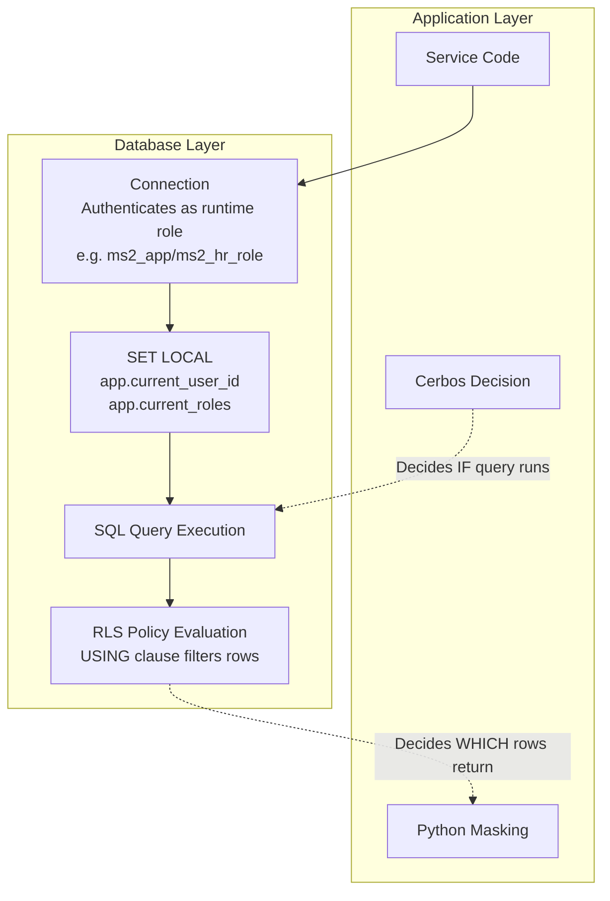
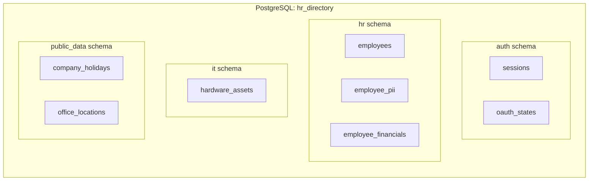
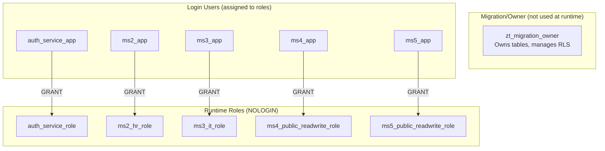
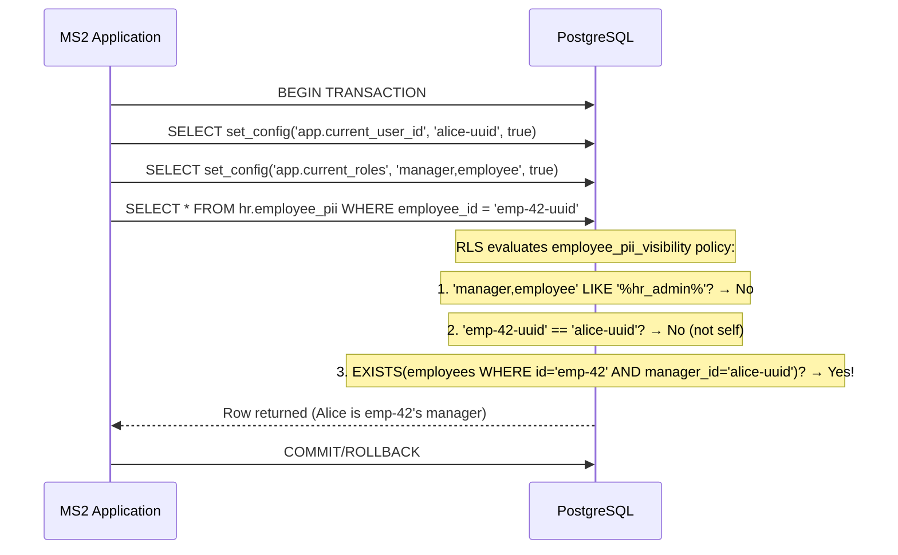
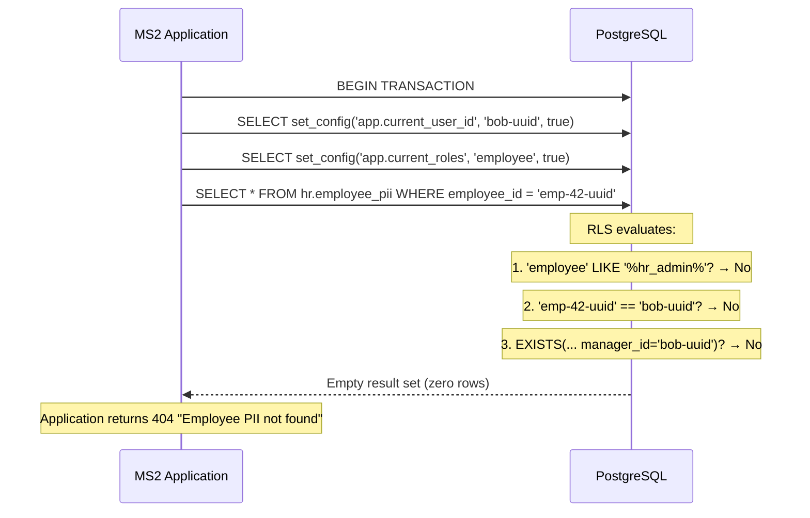

# Data Layer Security

Deep dive into PostgreSQL schema segregation, runtime roles, row-level security policies, and RLS context propagation.

---

## Role in the Architecture

PostgreSQL is the final defense layer. If all application-level controls fail (Cerbos bug, masking bypass, code injection), RLS ensures:
- A service can only query its own schema
- Within that schema, only rows matching the current user's permissions are returned
- Write operations are restricted to authorized roles



---

## Schema Segregation



### Service-to-Schema Mapping

| Service | Schema Access | Tables |
|---------|-------------|--------|
| auth-service | `auth` | sessions, oauth_states |
| ms2-employee-details | `hr` | employees, employee_pii, employee_financials |
| ms3-hardware-assets | `it` | hardware_assets |
| ms4-holiday-calendar | `public_data` | company_holidays |
| ms5-office-locations | `public_data` | office_locations |
| ms1-profile-aggregator | None | No database access |

A service cannot access another service's schema — enforced by PostgreSQL GRANT/REVOKE, independent of Istio policies.

---

## Runtime Roles & Privileges

### Role Hierarchy



### Privilege Matrix

| Role | Schema Access | Privileges |
|------|-------------|------------|
| `auth_service_role` | `auth` | SELECT, INSERT, UPDATE, DELETE on sessions + oauth_states |
| `ms2_hr_role` | `hr` | SELECT, INSERT, UPDATE, DELETE on employees, employee_pii, employee_financials |
| `ms3_it_role` | `it` | SELECT, INSERT, UPDATE, DELETE on hardware_assets. REFERENCES on hr.employees |
| `ms4_public_readwrite_role` | `public_data` | SELECT, INSERT, UPDATE, DELETE on company_holidays. USAGE on sequences. |
| `ms5_public_readwrite_role` | `public_data` | SELECT, INSERT, UPDATE, DELETE on office_locations. USAGE on sequences. |

### Security Properties

- **No BYPASSRLS**: Runtime roles cannot bypass RLS even if they own the connection.
- **Don't own tables**: Runtime roles use tables created by the migration role. They can't `ALTER TABLE` or `DROP POLICY`.
- **Schema isolation**: `REVOKE ALL ON SCHEMA hr FROM PUBLIC` prevents any role from accessing `hr` unless explicitly granted.
- **FORCE ROW LEVEL SECURITY**: Even the table owner role is subject to RLS (set on sensitive tables).

---

## Row-Level Security Policies

### `hr.employees` — Employee Visibility

```sql
CREATE POLICY employees_visibility ON hr.employees
  USING (
    NULLIF(current_setting('app.current_user_id', true), '') IS NOT NULL
  )
  WITH CHECK (current_setting('app.current_roles', true) LIKE '%hr_admin%');
```

| Operation | Rule |
|-----------|------|
| SELECT | Any principal with a non-empty `app.current_user_id` can read all directory rows |
| INSERT/UPDATE/DELETE | `WITH CHECK` — only `hr_admin` can write |

The directory table is intentionally open at the row level for authenticated users. Cerbos controls which columns are returned. Sensitive data lives in `employee_pii` and `employee_financials`, which keep stricter RLS. If MS2 forgets to set RLS context, `app.current_user_id` is empty and zero rows are returned (fail closed).

### Role Access Matrix (RLS + Cerbos combined)

| Role | Directory (`hr.employees`) | PII / Financials | Hardware assets |
|------|---------------------------|------------------|-----------------|
| employee | All rows (Cerbos masks fields) | Self (+ manager for direct reports) | Own only |
| manager | All rows | Self + direct reports | Own only |
| hr_admin | All rows | All rows | None |
| it_admin | All rows (public fields only via Cerbos) | None | All rows |

### `hr.employee_pii` — PII Visibility

```sql
CREATE POLICY employee_pii_visibility ON hr.employee_pii
  USING (
    current_setting('app.current_roles', true) LIKE '%hr_admin%'
    OR employee_id::text = current_setting('app.current_user_id', true)
    OR EXISTS (
      SELECT 1 FROM hr.employees e
      WHERE e.id = employee_id
        AND e.manager_id::text = current_setting('app.current_user_id', true)
    )
  )
  WITH CHECK (current_setting('app.current_roles', true) LIKE '%hr_admin%');
```

| Operation | Rule |
|-----------|------|
| SELECT | Visible if: hr_admin, OR self, OR direct report of current user |
| INSERT/UPDATE/DELETE | Only hr_admin |

### `hr.employee_financials` — Financial Data Visibility

Same policy structure as PII:
- hr_admin: full access
- Self: can see own financials
- Manager: can see direct reports' financials
- Others: no rows returned

### `it.hardware_assets` — Asset Visibility

```sql
CREATE POLICY hardware_assets_visibility ON it.hardware_assets
  USING (
    current_setting('app.current_roles', true) LIKE '%it_admin%'
    OR employee_id::text = current_setting('app.current_user_id', true)
  )
  WITH CHECK (current_setting('app.current_roles', true) LIKE '%it_admin%');
```

| Operation | Rule |
|-----------|------|
| SELECT | it_admin sees all, employees see only their own assigned assets |
| INSERT/UPDATE/DELETE | Only it_admin |

---

## RLS Context Propagation

### How It Works

Each service sets transaction-local configuration variables before executing queries:

```python
async def set_rls_context(session: AsyncSession, user_id: str, roles: str, request_id: str):
    await session.execute(
        text("SELECT set_config('app.current_user_id', :user_id, true)"),
        {"user_id": user_id}
    )
    await session.execute(
        text("SELECT set_config('app.current_roles', :roles, true)"),
        {"roles": roles}
    )
    if request_id:
        await session.execute(
            text("SELECT set_config('app.request_id', :request_id, true)"),
            {"request_id": request_id}
        )
```

### Critical: `is_local=true`

The third parameter to `set_config` is `true`, meaning the value is **transaction-local**. It:
- Only exists for the duration of the current transaction
- Is invisible to other connections
- Cannot leak across pooled connections
- Automatically resets when the transaction ends

### Context Source

The context values come from the **projected legacy headers** (which were derived from the verified JWT):

```python
user_id = headers["user"]       # From x-ms2-user (projected from sub claim)
roles = headers["role"]         # From x-ms2-role (projected from roles_csv claim)
request_id = headers.get("request_id", "")  # From x-request-id
```

This is important: RLS context is set from platform-verified identity, not from user-supplied input.

---

## Flow: Query with RLS



### What happens when RLS denies:



RLS denial is invisible to the application — it simply sees no rows. This is by design: the application doesn't need to know *why* rows are missing.

---

## Relationship Between Cerbos and RLS

| Concern | Cerbos | RLS |
|---------|--------|-----|
| Granularity | Field-level masking | Row-level visibility |
| Decision timing | Before query (can avoid unnecessary DB calls) | During query (inline with SELECT) |
| What it controls | "Can you see salary?" → mask/show | "Can you see this employee at all?" → include/exclude row |
| Failure mode | Fail closed (deny on error) | Fail closed (no rows if context missing) |
| Policy location | YAML in ConfigMap | SQL in migration |

They are complementary, not redundant:
- Cerbos might allow viewing employee 42's profile but mask the salary field
- RLS ensures that even if Cerbos is wrong, Bob can't see Alice's PII row at all (unless Bob is Alice's manager or hr_admin)

---

## Missing RLS Context

If `app.current_user_id` or `app.current_roles` is not set (empty string or null via `current_setting(..., true)`):

- `current_setting('app.current_roles', true)` returns empty string (the `true` flag means "return null/empty if not set, don't error")
- `'' LIKE '%hr_admin%'` → false
- `employee_id::text = ''` → false (no self-match)
- `manager_id::text = ''` → false (no manager match)
- Result: **zero rows returned** → fail closed

This is the correct behavior: a request without proper identity context sees nothing.
