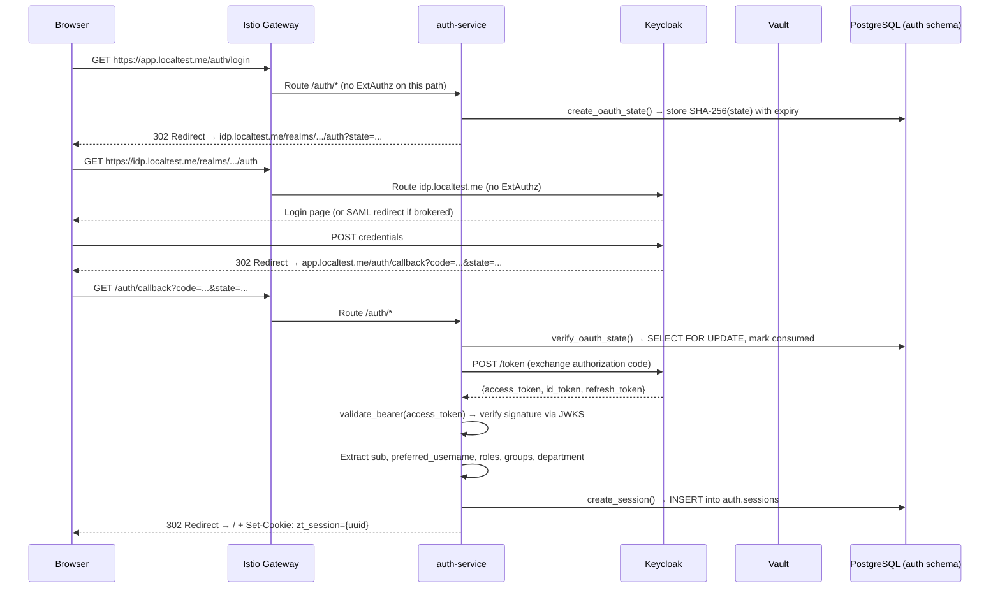
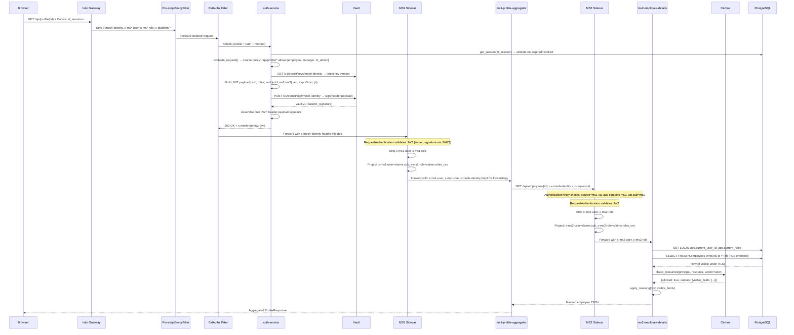
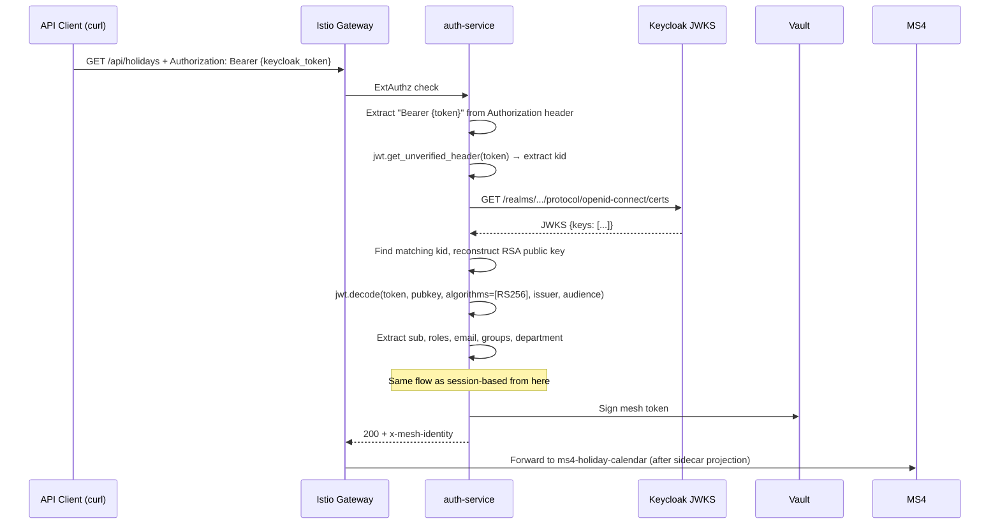
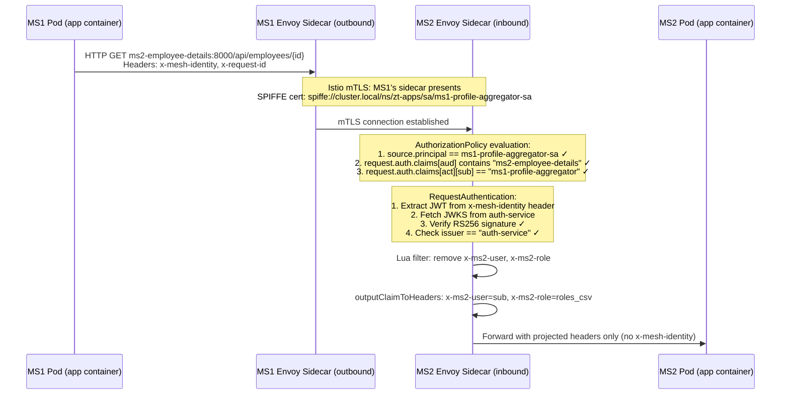
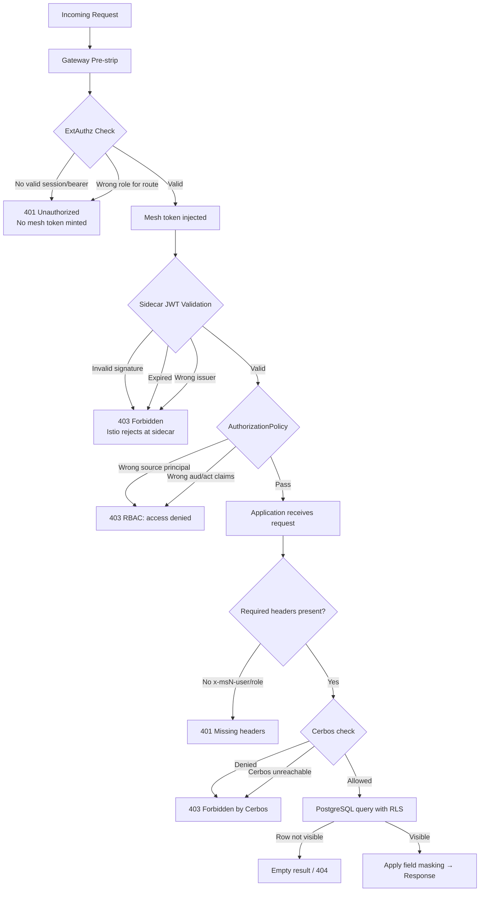
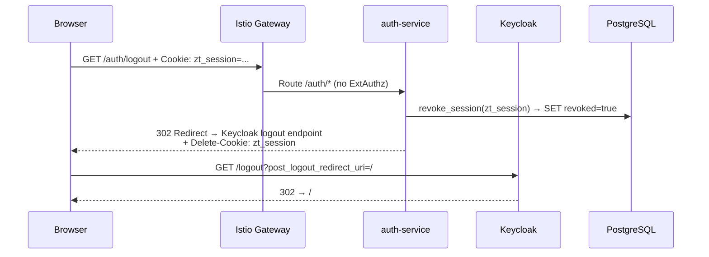
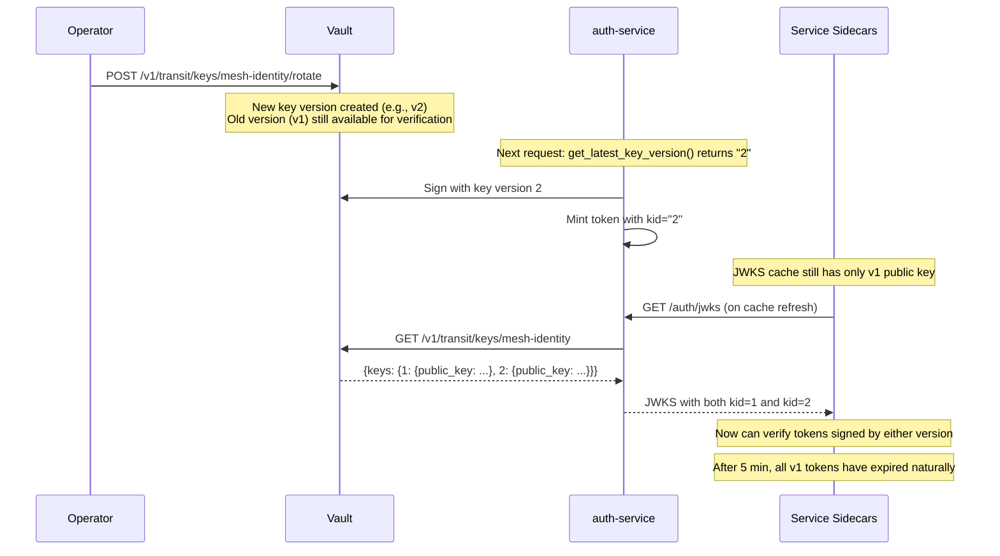

# End-to-End Request Flows

This document traces complete request paths through the system, step by step. Each flow shows how the security layers compose to establish and propagate identity.

---

## 1. Browser Login Flow (OIDC Authorization Code)

A user with no existing session visits the application for the first time.

### Step-by-step breakdown:

1. **Browser → `/auth/login`**: The gateway routes `/auth/*` directly to auth-service. No ExtAuthz — this avoids an authentication loop.

2. **State generation**: auth-service generates a `secrets.token_urlsafe(32)`, stores its SHA-256 hash in `auth.oauth_states` with a 15-minute expiry. The raw state goes in the redirect URL.

3. **Keycloak redirect**: Browser redirects to `idp.localtest.me`. Keycloak handles credential collection. If SAML brokering is configured, Keycloak further redirects to the enterprise IdP and normalizes the SAML assertion back into an OIDC session.

4. **Callback**: Browser returns to `/auth/callback` with an authorization code and the state parameter.

5. **State verification**: auth-service hashes the incoming state, does a `SELECT ... FOR UPDATE` to atomically check it hasn't been consumed and hasn't expired. Marks it consumed. This prevents CSRF and replay.

6. **Code exchange**: auth-service calls Keycloak's token endpoint (server-to-server, inside the mesh) with the authorization code + client_secret.

7. **Token validation**: auth-service validates the received access_token by fetching Keycloak's JWKS and verifying the RSA signature. Extracts user claims.

8. **Session creation**: A new row in `auth.sessions` stores: user_id (deterministic UUID5 from username), username, email, roles, groups, department, expiry (1 hour). The session ID is a random UUID4.

9. **Cookie set**: The response sets `zt_session={uuid}` as HttpOnly, Secure, SameSite=lax, path=/, max_age=3600.

---

## 2. Authenticated API Request (Profile Fetch)

An authenticated user requests `GET /api/profile/{employee_id}`.

### Step-by-step breakdown:

**At the Gateway (steps 1-3):**

1. Request arrives with the `zt_session` cookie. The pre-strip Lua filter removes any externally-supplied identity headers (`x-mesh-identity`, `x-ms*-user/role`, `x-platform-*`).

2. The ExtAuthz policy matches `/api/*` paths and pauses the request, sending it to auth-service for evaluation.

**At auth-service / ExtAuthz (steps 4-9):**

3. auth-service extracts the session cookie, calls `get_session()` which validates the UUID, checks expiry, checks revocation, and updates `last_seen_at`.

4. `evaluate_request()` normalizes the path (strips `/verify` prefix if present), determines the coarse route/role policy. For `/api/profile/*`, allowed roles are: `employee`, `manager`, `hr_admin`.

5. If the user's roles intersect with allowed roles, auth-service builds the mesh token payload:
   - `sub`: deterministic UUID5 from username
   - `roles`: from session (array) + `roles_csv` (comma-separated for header projection)
   - `aud`: `["ms1-profile-aggregator", "ms2-employee-details", "ms3-hardware-assets"]`
   - `act`: `{"sub": "ms1-profile-aggregator"}` (delegation context)
   - `exp`: now + 5 minutes
   - `jti`: random UUID4
   - `kid`: latest Vault key version

6. Vault Transit signs the `header.payload` bytes and returns the signature in `vault:v1:{base64}` format. auth-service strips the prefix and assembles the final JWT.

7. Returns 200 with `x-mesh-identity` header. Istio's ExtAuthz mechanism injects this header into the upstream request.

**At MS1's sidecar (steps 10-12):**

8. The `RequestAuthentication` resource validates the JWT in `x-mesh-identity`:
   - Fetches JWKS from `http://auth-service.zt-apps.svc.cluster.local:8000/auth/jwks`
   - Verifies RS256 signature
   - Checks issuer = "auth-service"

9. The header-projection Lua filter strips any pre-existing `x-ms1-user`/`x-ms1-role`, then `outputClaimToHeaders` projects:
   - `x-ms1-user` ← `sub` claim
   - `x-ms1-role` ← `roles_csv` claim

10. MS1 receives both the projected legacy headers AND `x-mesh-identity` (forwardOriginalToken=true for ms1, since it needs to forward it downstream).

**At MS1 application (step 13):**

11. MS1 validates it has `x-ms1-user` and `x-ms1-role` headers (401 if missing). Extracts `x-mesh-identity` for downstream forwarding.

12. Fans out concurrent requests to MS2 (`/api/employees/{id}`, `/api/employees/{id}/financials`, `/api/employees/{id}/pii`) and MS3 (`/api/assets?employee_id={id}`), forwarding `x-mesh-identity` and `x-request-id`.

**At MS2's sidecar (steps 14-16):**

13. `AuthorizationPolicy` checks:
    - Source principal = `cluster.local/ns/zt-apps/sa/ms1-profile-aggregator-sa`
    - JWT claim `aud` contains `ms2-employee-details`
    - JWT claim `act.sub` = `ms1-profile-aggregator`

14. `RequestAuthentication` validates the JWT signature (same as ms1's sidecar).

15. Header projection: strips `x-ms2-user/role`, projects from verified claims. `forwardOriginalToken=false` — MS2 app never sees the raw JWT.

**At MS2 application (steps 17-21):**

16. MS2 extracts `x-ms2-user` (the subject) and `x-ms2-role` (comma-separated roles). Splits roles.

17. Sets RLS context: `SELECT set_config('app.current_user_id', ..., true)` and `set_config('app.current_roles', ..., true)` within the transaction.

18. Executes the query. PostgreSQL RLS evaluates the `employees_visibility` policy against the current config values.

19. Calls Cerbos with principal (user_id, roles) and resource (employee_id, manager_id, department, status) to get the authorization decision + visible fields output.

20. Applies field masking: only returns fields in the `visible_fields` set. Computes derived fields like `salary_band` if applicable.

21. Returns the masked JSON response.

---

## 3. Bearer Token API Request

An API client (curl, service account) uses a Keycloak access token directly.

### Key differences from browser flow:

- No session lookup — auth-service checks the `Authorization` header first, before falling back to cookie.
- Token validation happens against Keycloak's JWKS endpoint (fetched per request — see audit note on caching).
- The audience validation has a fallback: if `aud` doesn't match, checks `azp` claim. This handles Keycloak's behavior where some token types use `azp` instead of `aud`.
- User identity is derived the same way: UUID5 from `preferred_username`, or raw `sub` if no username.

---

## 4. Service-to-Service Call with Delegation (MS1 → MS2)

This details what happens at the network level when MS1 calls MS2 internally.

### Trust checks at MS2's boundary (all must pass):

| Check | Layer | What it proves |
|-------|-------|----------------|
| mTLS source principal | Istio AuthorizationPolicy | The calling *workload* is MS1 (not a rogue pod) |
| JWT signature valid | RequestAuthentication | The token was minted by auth-service (Vault-signed) |
| `aud` contains `ms2-employee-details` | AuthorizationPolicy `when` | The token was intended for this service |
| `act.sub` = `ms1-profile-aggregator` | AuthorizationPolicy `when` | The delegation context is legitimate |
| Token not expired | RequestAuthentication | The token is fresh (5 min window) |

A stolen token replayed from a different pod fails check #1. A token minted for a different service fails check #3. An old token fails check #5.

---

## 5. Denied Request Flow

When authorization fails at any layer.

### Fail-closed guarantees:

| Component Down | Effect |
|----------------|--------|
| auth-service | ExtAuthz can't evaluate → deny (503/401) |
| Vault | Can't sign mesh token → deny (500 at auth-service) |
| Keycloak JWKS | Can't validate bearer → deny. Sidecars use cache until TTL. |
| Cerbos | `check_cerbos()` catches exception → returns `{allowed: False}` → 403 |
| PostgreSQL | No session validation, no data → total failure |

---

## 6. Logout Flow

Post-logout state:
- The `zt_session` cookie is deleted from the browser.
- The session row in PostgreSQL has `revoked=true` — any subsequent use of the old session ID will be rejected by `get_session()`.
- Keycloak's own session is also terminated, so re-login requires full authentication.

---

## 7. Vault Key Rotation Flow

When the Vault Transit signing key is rotated:

### Rotation window:
- Old tokens (kid=1) remain valid until their 5-minute expiry.
- New tokens immediately use kid=2.
- The JWKS endpoint always serves ALL active key versions.
- Brief window: if a sidecar's JWKS cache hasn't refreshed but receives a kid=2 token, that token will be rejected until the cache refreshes. Istio's default JWKS refresh interval (typically 5 minutes) means this window is short.
