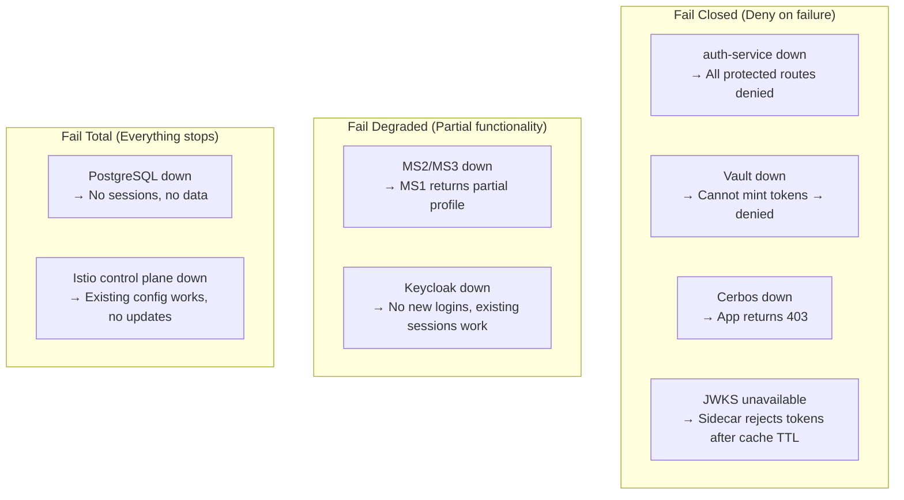
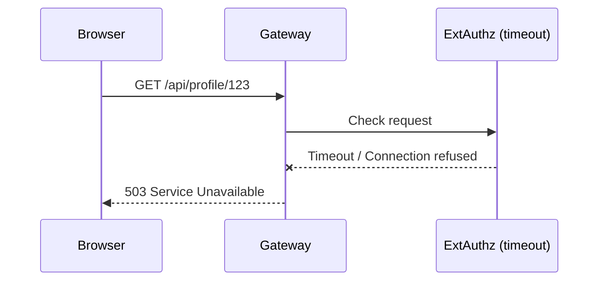
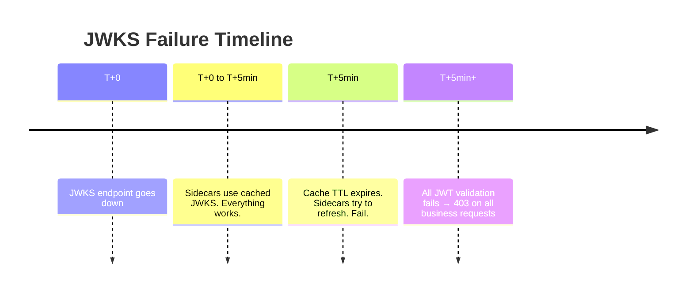
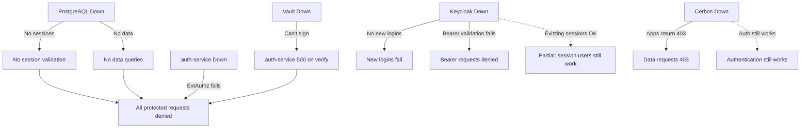

# Failure Modes & Degradation

How each component's failure affects the system, whether it fails open or closed, and the cascading impact.

---

## Failure Mode Map



---

## Component Failure Details

### 1. auth-service Down

| Aspect | Impact |
|--------|--------|
| **What breaks** | ExtAuthz cannot evaluate → gateway returns 503 or deny |
| **What still works** | Keycloak login page (separate route), health endpoints, static assets |
| **Fail mode** | **CLOSED** — no requests pass ExtAuthz without a decision |
| **Detection** | Gateway returns 503 on `/api/*` paths |
| **Recovery** | Pod restart. Sessions are in PostgreSQL, so state survives restart. |



**E2E test coverage**: `test-security-negative-paths.sh` scales auth-service to 0 and verifies the gateway denies requests.

---

### 2. Vault Down

| Aspect | Impact |
|--------|--------|
| **What breaks** | auth-service cannot sign mesh tokens → ExtAuthz returns 500 |
| **What still works** | Session validation (PostgreSQL), OIDC flows (Keycloak). But without a signed token, no business request can proceed. |
| **Fail mode** | **CLOSED** — auth-service catches the Vault error and returns 500 |
| **Detection** | auth-service logs Vault connection errors; `/verify/*` returns 500 |
| **Recovery** | Restore Vault. No state loss (Transit keys are persisted). |

Impact chain:
```
Vault down → sign_payload() raises → create_mesh_token() raises
→ /verify endpoint returns 500 → ExtAuthz sees non-200 → deny
```

**Existing sessions are NOT affected for session introspection** (`/auth/session` doesn't need Vault), but they can't make business API calls.

---

### 3. Keycloak Down

| Aspect | Impact |
|--------|--------|
| **What breaks** | New browser logins fail. Bearer token validation fails (JWKS fetch). |
| **What still works** | Existing sessions (stored in PostgreSQL, validated locally). |
| **Fail mode** | **PARTIAL** — existing sessions continue, new auth fails |
| **Detection** | Login redirects fail; bearer validation returns None |
| **Recovery** | Restore Keycloak. User sessions in Keycloak are independent from app sessions. |

Two failure paths:
1. **Browser login**: Redirect to Keycloak fails → user sees error page
2. **Bearer validation**: `_get_keycloak_public_keys()` raises → `validate_bearer()` returns None → deny

**Key insight**: Users with existing `zt_session` cookies can continue using the app because session validation is local (PostgreSQL lookup, no Keycloak call). Only new logins and bearer token requests fail.

---

### 4. Cerbos Down

| Aspect | Impact |
|--------|--------|
| **What breaks** | Authorization checks in ms2/ms3/ms4/ms5 fail |
| **What still works** | auth-service (doesn't use Cerbos), session management, ms1 routing |
| **Fail mode** | **CLOSED** — `check_cerbos()` catches all exceptions and returns `{allowed: False}` |
| **Detection** | Services return 403 on all data requests; logs show Cerbos connection errors |
| **Recovery** | Restore Cerbos deployment. Stateless — no recovery needed. |

```python
except Exception as e:
    logger.error(f"Cerbos check failed: {e}")
    return {"allowed": False, "outputs": {}}
```

**User experience**: Authenticated requests reach the service but get 403 on every data endpoint. Health checks still pass.

---

### 5. PostgreSQL Down

| Aspect | Impact |
|--------|--------|
| **What breaks** | Everything that uses data: sessions, employee data, assets, holidays, offices |
| **What still works** | Health endpoints, Keycloak (has its own DB in production, uses embedded H2 in dev) |
| **Fail mode** | **TOTAL** — no sessions = no authentication, no data = no responses |
| **Detection** | All endpoints return 500; database connection errors in all service logs |
| **Recovery** | Restore PostgreSQL. StatefulSet with persistent volume preserves data. |

This is the most impactful single point of failure. The entire authentication chain (session lookup) and all data queries depend on PostgreSQL.

---

### 6. JWKS Endpoint Unavailable

| Aspect | Impact |
|--------|--------|
| **What breaks** | Sidecars cannot refresh JWKS → eventually reject all mesh tokens |
| **What still works** | Everything — until the sidecar cache expires |
| **Fail mode** | **DELAYED CLOSED** — works on cached JWKS until cache TTL expires |
| **Detection** | After cache expiry: all requests to sidecars with JWT validation return 403 |
| **Recovery** | Restore auth-service or its `/auth/jwks` endpoint |



**Istio configuration note**: `PILOT_JWT_ENABLE_REMOTE_JWKS: "true"` ensures sidecars fetch JWKS directly (over mTLS) rather than through the control plane, preventing istiod from becoming a bottleneck.

---

### 7. Vault Key Rotation During Outage

| Aspect | Impact |
|--------|--------|
| **Scenario** | Vault key is rotated while sidecars can't refresh JWKS |
| **What breaks** | New tokens use new kid → sidecars don't have new public key → reject |
| **Fail mode** | **CLOSED** — new tokens rejected, old tokens expire in 5 min |
| **Detection** | JWT validation failures with "key not found" errors |
| **Recovery** | Restore JWKS endpoint. Sidecars refresh and pick up new key. |

This is a compound failure — rotation should not happen during an auth-service outage. The rotation procedure should verify JWKS is serving correctly first.

---

### 8. MS2 or MS3 Down

| Aspect | Impact |
|--------|--------|
| **What breaks** | MS1 profile aggregation gets partial data |
| **What still works** | MS1 returns what it can (graceful degradation) |
| **Fail mode** | **DEGRADED** — partial response with error indicators |
| **Detection** | `assets_error`, `pii_error`, `fin_error` fields in ProfileResponse |

```python
if isinstance(ms2_res, Exception):
    raise HTTPException(status_code=502, detail="Error communicating with MS2")

# But for optional data (financials, PII, assets):
if isinstance(ms2_fin_res, Exception):
    fin_error = "Connection error"
# ... continue building response with partial data
```

MS1's degradation behavior:
- **MS2 base employee data fails**: 502 (can't build profile without core data)
- **MS2 financials/PII fails**: Partial response with error field set
- **MS3 assets fails**: Partial response with `assets_error` set

---

### 9. Istio Control Plane (istiod) Down

| Aspect | Impact |
|--------|--------|
| **What breaks** | No new configuration pushed, no new certificate rotation |
| **What still works** | Existing Envoy configs continue operating. mTLS certs are valid until rotation. |
| **Fail mode** | **STATIC** — system operates on last-known-good config |
| **Detection** | `istioctl proxy-status` shows disconnected proxies |
| **Recovery** | Restore istiod. Proxies reconnect and sync. |

**Important**: Existing security policies (AuthorizationPolicy, RequestAuthentication) continue to be enforced by Envoy. The data plane operates independently of the control plane for existing configuration.

---

## Cascading Failures



### Dependency Criticality Ranking

| Component | If Down | Impact Scope | Time to Impact |
|-----------|---------|--------------|----------------|
| PostgreSQL | Total outage | All services | Immediate |
| auth-service | Full denial | All protected routes | Immediate |
| Vault | Full denial | All protected routes | Immediate |
| Keycloak | Partial (no new auth) | New logins + bearer | Immediate for new, none for existing |
| Cerbos | Data denial | Data endpoints only | Immediate |
| JWKS cache | Delayed denial | All routes | After cache TTL (~5 min) |
| istiod | Static operation | No config updates | None (until certs expire) |

---

## Recovery Priorities

In a multi-component failure, restore in this order:

1. **PostgreSQL** — Everything depends on it (sessions + data)
2. **Vault** — Required for auth-service to function
3. **auth-service** — Required for any protected request
4. **Keycloak** — Required for new logins (existing sessions work without it)
5. **Cerbos** — Required for data access (auth works without it)

---

## Monitoring Indicators

| Signal | Meaning |
|--------|---------|
| auth-service `/health` returns non-200 | auth-service is down or unhealthy |
| Gateway returning 503 on `/api/*` | ExtAuthz cannot reach auth-service |
| Services returning 403 universally | Cerbos is likely down |
| Services returning 500 | Database connection issue |
| Bearer requests failing but sessions working | Keycloak JWKS unreachable |
| All requests failing after working period | JWKS cache expired without refresh |
