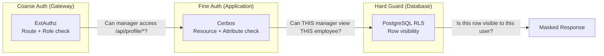
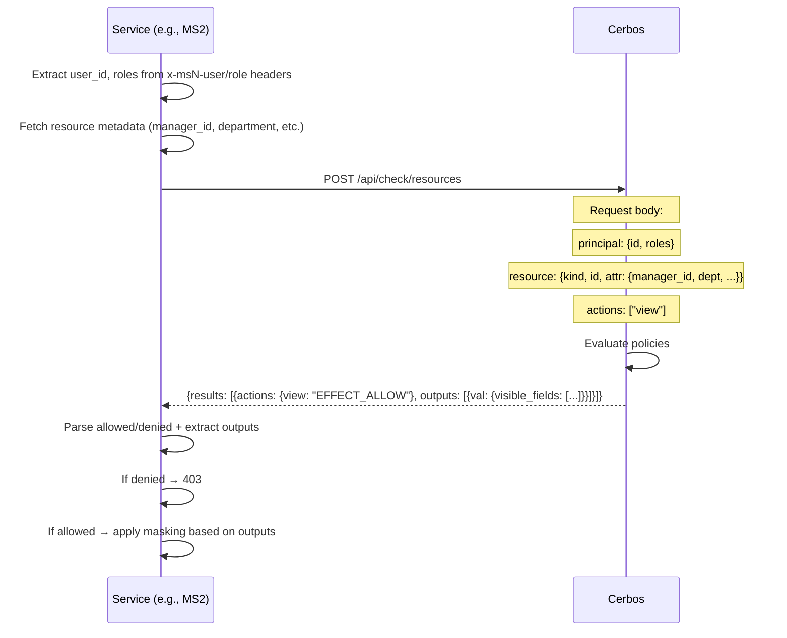

# Fine-Grained Authorization (Cerbos)

Deep dive into Cerbos policy evaluation, the integration pattern, and how masking directives flow from policy to response.

---

## Role in the Architecture

Cerbos answers two questions that coarse RBAC cannot:

1. **"Is this specific action on this specific resource allowed?"** — e.g., "Can Alice (manager) view employee 42's PII?" (only if 42 is Alice's direct report)
2. **"What should the response look like?"** — e.g., "Show salary_band but not base_salary"



Each layer has different context:
- **ExtAuthz**: Knows route + user roles. No resource context.
- **Cerbos**: Knows user + resource attributes (manager_id, department, sensitivity).
- **RLS**: Knows user_id + roles via transaction-local context. Enforces row-level boundaries.

---

## Cerbos Deployment

Cerbos runs as a central Policy Decision Point (PDP) service in the `zt-security` namespace:
- HTTP API on port 3592
- gRPC API on port 3593
- Policies loaded from ConfigMap (mounted from `cerbos/policies/`)
- Reachable only from ms2, ms3, ms4, ms5 (AuthorizationPolicy enforced)

---

## Policy Structure

### Employee Profile Policy

```yaml
apiVersion: api.cerbos.dev/v1
resourcePolicy:
  version: default
  resource: employee_profile
  rules:
    # Basic view for employees and IT admins
    - actions: ["view", "list"]
      effect: EFFECT_ALLOW
      roles: ["employee", "it_admin"]
      output:
        expr: |-
          {
            "mask_profile": "public_only",
            "visible_fields": ["name", "title", "department"]
          }

    # Self-access for sensitive data
    - actions: ["view_sensitive", "update"]
      effect: EFFECT_ALLOW
      roles: ["employee"]
      condition:
        match:
          expr: request.principal.id == request.resource.attr.id
      output:
        expr: |-
          {
            "mask_profile": "unmasked",
            "visible_fields": ["name", "title", "department", "salary_band", "base_salary", "ssn"]
          }

    # Manager view of direct reports
    - actions: ["view_sensitive"]
      effect: EFFECT_ALLOW
      roles: ["manager"]
      condition:
        match:
          expr: request.principal.id == request.resource.attr.manager_id
      output:
        expr: |-
          {
            "mask_profile": "manager_view",
            "visible_fields": ["name", "title", "department", "salary_band"]
          }

    # HR admin full access
    - actions: ["view", "view_sensitive", "list", "update"]
      effect: EFFECT_ALLOW
      roles: ["hr_admin"]
      output:
        expr: |-
          {
            "mask_profile": "unmasked",
            "visible_fields": ["name", "title", "department", "salary_band", "base_salary", "ssn"]
          }
```

### Hardware Asset Policy

```yaml
resourcePolicy:
  resource: hardware_asset
  rules:
    # Employee can see own assets (truncated serial)
    - actions: ["view", "list"]
      effect: EFFECT_ALLOW
      roles: ["employee"]
      condition:
        match:
          expr: request.principal.id == request.resource.attr.owner_id
      output:
        expr: |-
          {"asset_serial_mode": "truncated"}

    # IT admin full access
    - actions: ["view", "list", "assign", "update"]
      effect: EFFECT_ALLOW
      roles: ["it_admin"]
      output:
        expr: |-
          {"asset_serial_mode": "full"}
```

---

## Integration Pattern

### How Services Call Cerbos

Every service uses the same pattern via `cerbos_client.py`:



### Cerbos Request Payload

```json
{
  "requestId": "req-abc-123",
  "principal": {
    "id": "550e8400-e29b-41d4-a716-446655440000",
    "roles": ["manager", "employee"]
  },
  "resources": [
    {
      "actions": ["view"],
      "resource": {
        "kind": "employee_profile",
        "id": "employee-42-uuid",
        "attr": {
          "id": "employee-42-uuid",
          "manager_id": "550e8400-e29b-41d4-a716-446655440000",
          "department": "Engineering",
          "status": "Active"
        }
      }
    }
  ]
}
```

### Cerbos Response Processing

```python
result = data.get("results", [])[0]
action_result = result.get("actions", {}).get(action, "EFFECT_DENY")
outputs = result.get("outputs", [])
action_output = outputs[0].get("val", {}) if outputs else {}

return {
    "allowed": action_result == "EFFECT_ALLOW",
    "outputs": action_output
}
```

---

## Actions by Resource

| Resource | Action | Meaning |
|----------|--------|---------|
| `employee_profile` | `view` | Basic employee info (name, title, dept) |
| `employee_profile` | `view_sensitive` | PII + financials access |
| `employee_profile` | `list` | List all employees |
| `employee_profile` | `update` | Modify employee record |
| `hardware_asset` | `view` | View single asset |
| `hardware_asset` | `list` | List assets |
| `hardware_asset` | `assign` | Assign asset to employee |
| `hardware_asset` | `update` | Modify asset |
| `holiday_calendar` | `view` | View single holiday |
| `holiday_calendar` | `list` | List all holidays |
| `office_location` | `view` | View single office |
| `office_location` | `list` | List all offices |

---

## Masking Pipeline

### From Policy Output to Response

```mermaid
flowchart TD
    A[Cerbos returns outputs:<br/>visible_fields: name, title, department, salary_band]
    B[masking.py: apply_masking]
    C[Field mapping:<br/>name → first_name, last_name<br/>title → job_title<br/>department → department<br/>salary_band → computed from base_salary]
    D[Always-allowed fields:<br/>id, employee_id, work_email,<br/>work_phone, manager_id, hire_date, status]
    E[Build response: only mapped + always-allowed fields]
    F[Special handling:<br/>salary_band = floor(salary/50k)*50 + "k-" + ceil]

    A --> B --> C --> D --> E --> F
```

### Field Mapping (MS2)

The masking module maps Cerbos's abstract field names to concrete schema fields:

| Cerbos Field | Schema Fields |
|-------------|---------------|
| `name` | `first_name`, `last_name` |
| `title` | `job_title` |
| `department` | `department` |
| `ssn` | `ssn`, `date_of_birth`, `personal_phone`, `home_address`, `gender` |
| `base_salary` | `base_salary`, `bonus`, `bank_account_number`, `routing_number` |
| `salary_band` | Computed: `"{floor}k-{ceil}k"` from `base_salary` |

Always included regardless of masking: `id`, `employee_id`, `work_email`, `work_phone`, `manager_id`, `hire_date`, `status`.

### Masking for Hardware Assets (MS3)

Different pattern — instead of field whitelisting, it controls serial number visibility:

| `asset_serial_mode` | Behavior |
|---------------------|----------|
| `"full"` | Full serial_number and mac_address shown |
| `"truncated"` | Last 4 chars of serial, mac_address hidden |

---

## Decision Matrix

### Employee Profile Access

| Caller Role | Action | Condition | Result | Visible Fields |
|-------------|--------|-----------|--------|----------------|
| employee | view | — | ALLOW | name, title, department |
| employee | view_sensitive | self (principal.id == resource.id) | ALLOW | all including ssn, salary |
| employee | view_sensitive | not self | DENY | — |
| manager | view_sensitive | direct report (principal.id == resource.manager_id) | ALLOW | name, title, dept, salary_band |
| manager | view_sensitive | not direct report | DENY | — |
| hr_admin | view/view_sensitive/list/update | — | ALLOW | all fields |
| it_admin | view/list | — | ALLOW | name, title, department |

### Hardware Asset Access

| Caller Role | Action | Condition | Result | Serial Mode |
|-------------|--------|-----------|--------|-------------|
| employee | view/list | own asset (principal.id == owner_id) | ALLOW | truncated |
| employee | view/list | not own | DENY | — |
| it_admin | view/list/assign/update | — | ALLOW | full |

---

## Fail-Closed Behavior

```python
try:
    async with httpx.AsyncClient() as client:
        response = await client.post(...)
        ...
except Exception as e:
    logger.error(f"Cerbos check failed: {e}")
    return {"allowed": False, "outputs": {}}
```

If Cerbos is unreachable, times out, or returns malformed data:
- The catch-all exception handler returns `allowed: False`
- The service returns 403 to the caller
- No data is exposed

This is the correct default for sensitive services. The tradeoff is that Cerbos downtime = service outage for protected paths.

---

## Testing Pattern

Tests use a monkeypatch default that allows all Cerbos calls, then override for specific deny-path tests:

```python
# conftest.py - default: allow everything
@pytest.fixture(autouse=True)
def default_cerbos_allow(monkeypatch):
    async def _allow(*args, **kwargs):
        return {"allowed": True, "outputs": {}}
    monkeypatch.setattr("main.check_cerbos", _allow)

# test_main.py - specific test: control outputs
with patch("main.check_cerbos", new_callable=AsyncMock) as mock:
    mock.return_value = {
        "allowed": True,
        "outputs": {"visible_fields": ["name", "work_email"]}
    }
    response = await client.get("/api/employees", headers=AUTH_HEADERS)
```

This approach:
- Keeps happy-path tests fast (no Cerbos dependency)
- Allows testing specific masking outputs
- Explicit deny tests verify the 403 behavior
