# Header Projection & Legacy Translation

Deep dive into how the canonical `x-mesh-identity` token is translated into per-service legacy headers at the sidecar boundary.

---

## The Problem

Legacy services expect identity in specific HTTP headers (e.g., `x-ms2-user`, `x-ms2-role`). Rewriting all services to parse JWTs is expensive and risky during migration. But accepting these headers from external sources is a security vulnerability — anyone can send `x-ms2-user: admin`.

## The Solution

A two-stage process at each pod's Envoy sidecar:
1. **Strip** any externally-supplied legacy headers (they can't be trusted)
2. **Project** verified JWT claims into the headers the application expects

The application never needs to know about JWTs, Vault, or OIDC — it just reads its familiar headers, and the platform guarantees they're trustworthy.

---

## Architecture

```mermaid
flowchart LR
    subgraph "Gateway Boundary"
        Incoming[Incoming Request]
        PreStrip[Pre-strip Filter<br/>Removes ALL identity headers]
        ExtAuthz[ExtAuthz<br/>Injects x-mesh-identity]
    end

    subgraph "MS2 Pod Boundary"
        LuaStrip[Lua Filter<br/>Strips x-ms2-user, x-ms2-role]
        ReqAuth[RequestAuthentication<br/>Validates JWT + projects claims]
        App[MS2 Application<br/>Reads x-ms2-user, x-ms2-role]
    end

    Incoming -->|"x-ms2-user: attacker<br/>x-mesh-identity: forged"| PreStrip
    PreStrip -->|"All identity headers removed"| ExtAuthz
    ExtAuthz -->|"x-mesh-identity: {valid JWT}"| LuaStrip
    LuaStrip -->|"x-ms2-user removed<br/>x-ms2-role removed"| ReqAuth
    ReqAuth -->|"x-ms2-user: verified_sub<br/>x-ms2-role: verified_roles"| App
```



---

## Stage 1: Gateway Pre-strip

A Lua EnvoyFilter on the Ingress Gateway runs BEFORE ExtAuthz at priority `-100`:

```lua
function envoy_on_request(request_handle)
  local headers_to_remove = {}
  for key, value in pairs(request_handle:headers()) do
    local lower_key = string.lower(key)
    if string.match(lower_key, "^x%-platform%-") or 
       string.match(lower_key, "^x%-role%-") or 
       lower_key == "x-mesh-identity" or 
       string.match(lower_key, "^x%-ms%d%-user") or 
       string.match(lower_key, "^x%-ms%d%-role") then
      table.insert(headers_to_remove, lower_key)
    end
  end
  for _, key in ipairs(headers_to_remove) do
    request_handle:headers():remove(key)
  end
end
```

### What it strips:
- `x-platform-*` — any platform identity headers
- `x-role-*` — any role assertion headers
- `x-mesh-identity` — the canonical mesh token (can't come from outside)
- `x-ms{N}-user` — per-service user headers
- `x-ms{N}-role` — per-service role headers

### Why at the gateway:
This is defense-in-depth. Even though sidecars also strip, the gateway strip ensures these headers never enter the mesh at all. It protects against:
- A misconfigured sidecar that doesn't strip
- A newly deployed service that hasn't configured its strip filter yet
- Any path where traffic bypasses a sidecar (shouldn't happen with STRICT mTLS, but belt + suspenders)

---

## Stage 2: Sidecar Lua Strip

Each service's inbound sidecar has its own Lua filter that strips the specific headers for that service:

```yaml
# header-projection-ms2.yaml
workloadSelector:
  labels:
    app: ms2-employee-details
configPatches:
  - applyTo: HTTP_FILTER
    match:
      context: SIDECAR_INBOUND
      listener:
        filterChain:
          filter:
            name: "envoy.filters.network.http_connection_manager"
            subFilter:
              name: "envoy.filters.http.jwt_authn"
    patch:
      operation: INSERT_BEFORE
      value:
        name: envoy.filters.http.lua.projection
        typed_config:
          inlineCode: |
            function envoy_on_request(request_handle)
              request_handle:headers():remove("x-ms2-user")
              request_handle:headers():remove("x-ms2-role")
            end
```

### Placement: INSERT_BEFORE `jwt_authn`

The Lua filter runs BEFORE the JWT authentication filter. This means:
1. First: strip any pre-existing `x-ms2-user`/`x-ms2-role` (they could be spoofed by an upstream caller)
2. Then: `jwt_authn` validates the JWT and projects new, verified values

This ordering is critical — if it ran AFTER, a spoofed header would reach the application.

---

## Stage 3: RequestAuthentication + Claim Projection

Istio's `RequestAuthentication` handles JWT validation and header projection in one step:

```yaml
apiVersion: security.istio.io/v1beta1
kind: RequestAuthentication
metadata:
  name: mesh-identity-ms2
  namespace: zt-apps
spec:
  selector:
    matchLabels:
      app: ms2-employee-details
  jwtRules:
    - issuer: "auth-service"
      jwksUri: "http://auth-service.zt-apps.svc.cluster.local:8000/auth/jwks"
      forwardOriginalToken: false
      fromHeaders:
        - name: "x-mesh-identity"
      outputClaimToHeaders:
        - header: "x-ms2-user"
          claim: "sub"
        - header: "x-ms2-role"
          claim: "roles_csv"
```

### Configuration per service:

| Service | Source Header | Output Headers | forwardOriginalToken |
|---------|-------------|----------------|---------------------|
| ms1 | x-mesh-identity | x-ms1-user (sub), x-ms1-role (roles_csv) | **true** (needs to forward to ms2/ms3) |
| ms2 | x-mesh-identity | x-ms2-user (sub), x-ms2-role (roles_csv) | false |
| ms3 | x-mesh-identity | x-ms3-user (sub), x-ms3-role (roles_csv) | false |
| ms4 | x-mesh-identity | x-ms4-user (sub), x-ms4-role (roles_csv) | false |
| ms5 | x-mesh-identity | x-ms5-user (sub), x-ms5-role (roles_csv) | false |

### Why MS1 keeps the original token:

MS1 is an aggregator — it calls MS2 and MS3 downstream. It needs `x-mesh-identity` in its outbound request so that MS2/MS3 sidecars can validate the token. All other services are leaf services that don't make downstream calls requiring mesh identity.

---

## Complete Filter Chain Order

For an inbound request to MS2:

```mermaid
flowchart TD
    A[Request arrives at MS2 sidecar<br/>Headers: x-mesh-identity, possibly x-ms2-user from ms1]
    B[Lua Strip Filter<br/>REMOVE x-ms2-user, x-ms2-role<br/>Priority: 10, INSERT_BEFORE jwt_authn]
    C[JWT Authentication Filter<br/>VALIDATE x-mesh-identity JWT<br/>PROJECT sub → x-ms2-user<br/>PROJECT roles_csv → x-ms2-role]
    D[AuthorizationPolicy Evaluation<br/>CHECK source principal<br/>CHECK aud/act claims]
    E[Request forwarded to MS2 app<br/>Headers: x-ms2-user, x-ms2-role, x-request-id<br/>NO x-mesh-identity (forwardOriginalToken: false)]

    A --> B --> C --> D --> E
```

---

## Header Contract Per Service

### What the application receives:

| Header | Source | Content | Example |
|--------|--------|---------|---------|
| `x-ms2-user` | JWT `sub` claim | User's deterministic UUID5 | `550e8400-e29b-41d4-a716-446655440000` |
| `x-ms2-role` | JWT `roles_csv` claim | Comma-separated roles | `manager,employee` |
| `x-request-id` | Passed through from gateway | Trace correlation ID | `req-abc-123` |

### What the application does NOT receive:
- `x-mesh-identity` (stripped by `forwardOriginalToken: false`)
- Raw Keycloak tokens
- Session IDs
- Any `x-platform-*` headers

### How the application uses these headers:

```python
async def get_ms2_headers(
    x_ms2_user: str | None = Header(None),
    x_ms2_role: str | None = Header(None),
    x_request_id: str | None = Header(None)
):
    if not x_ms2_user or not x_ms2_role:
        raise HTTPException(status_code=401, detail="Missing required legacy headers")
    return {"user": x_ms2_user, "role": x_ms2_role, "request_id": x_request_id}
```

The 401 on missing headers is a defense-in-depth check. If the sidecar is working correctly, these headers will always be present for authenticated requests. The check catches misconfigurations.

---

## Security Guarantees

| Threat | Mitigation |
|--------|-----------|
| External attacker sends `x-ms2-user: admin` | Gateway pre-strip removes it before it enters the mesh |
| MS1 sends `x-ms2-user: spoofed` alongside x-mesh-identity | MS2 sidecar Lua strip removes it before JWT validation |
| Attacker sends forged `x-mesh-identity` | JWT signature validation fails (no Vault private key) |
| Valid JWT with wrong audience sent to wrong service | AuthorizationPolicy rejects (aud check) |
| Token from legitimate ms1 replayed from rogue pod | AuthorizationPolicy rejects (source principal check) |

---

## Why Not Parse JWT in Application Code?

The projection pattern was chosen over in-app JWT parsing because:

1. **Legacy compatibility**: Services keep their existing header contracts unchanged.
2. **Separation of concerns**: Security validation (signature, expiry, claims) stays in infrastructure. Application focuses on business logic.
3. **Consistent enforcement**: Every service gets the same validation regardless of language/framework. A Go service, a Java service, and a Python service all just read `x-msN-user`.
4. **No library dependencies**: Services don't need JWT libraries, JWKS fetching, key caching, etc.
5. **Migration path**: A service can be moved behind the mesh without code changes — just configure its header projection.
