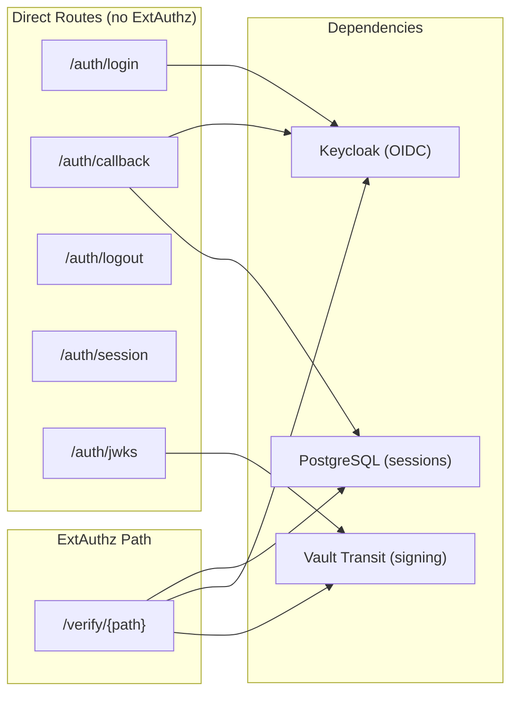
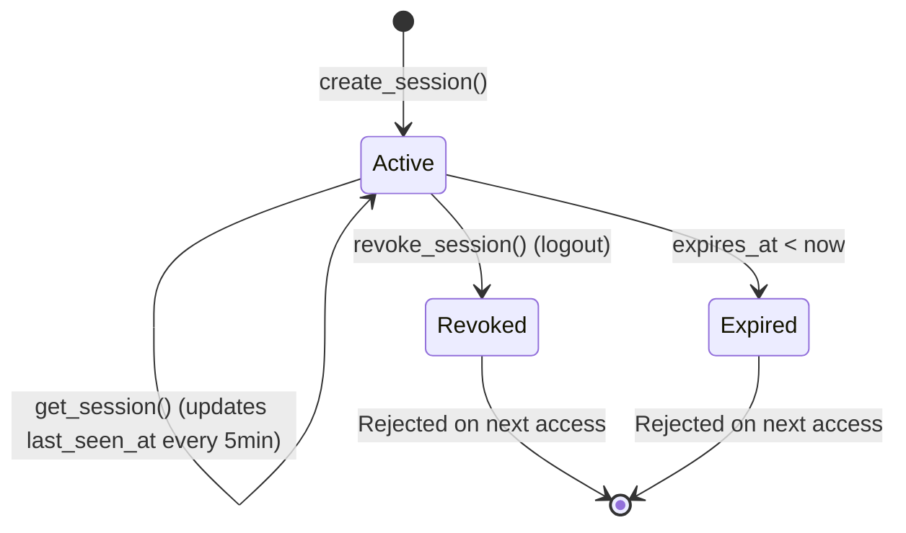
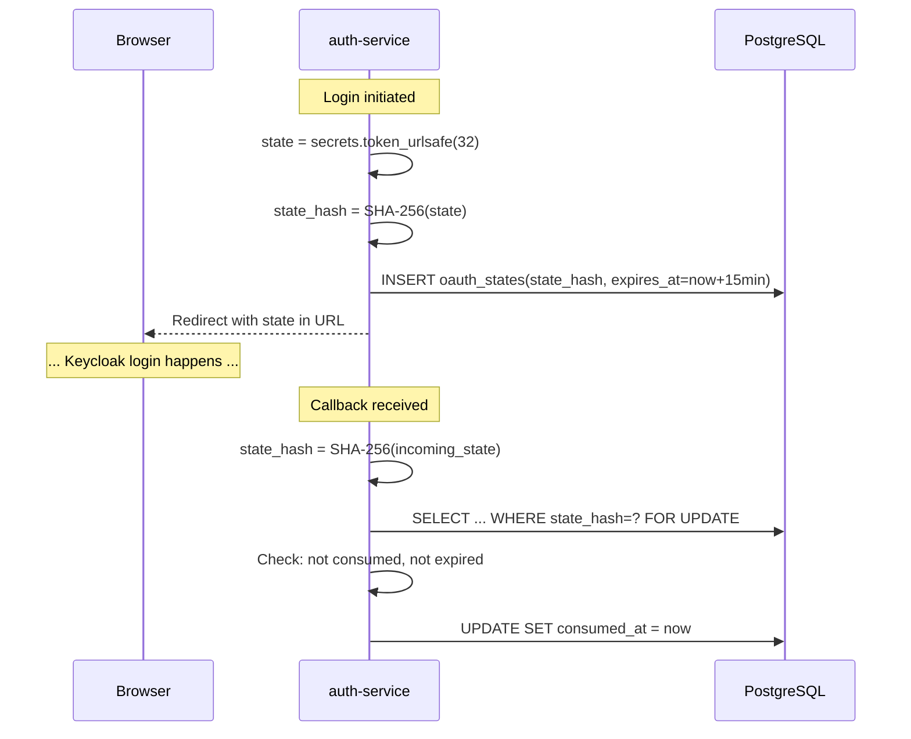
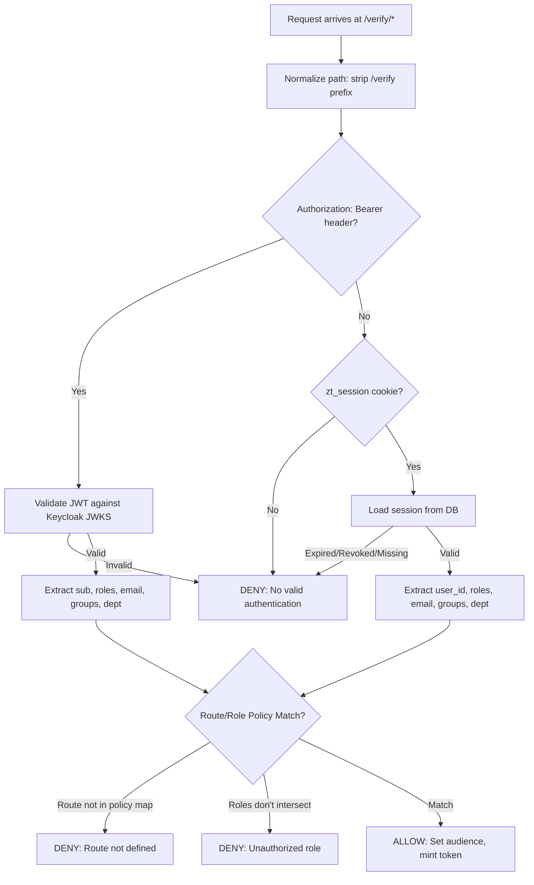

# Identity & Auth Edge

Deep dive into `auth-service`: the custom authentication edge that bridges external identity (Keycloak) to internal mesh identity (`x-mesh-identity`).

---

## What auth-service Does

auth-service has two operational modes on the same FastAPI application:

1. **Direct route handler** (`/auth/*`): Browser login, callback, logout, session introspection, JWKS publication.
2. **ExtAuthz provider** (`/verify/*`): Evaluates every protected business request, decides allow/deny, and mints mesh tokens on allow.



---

## Session Management

### Session Model (`auth.sessions`)

| Column | Type | Purpose |
|--------|------|---------|
| `id` | UUID4 (PK) | Opaque session identifier — this is what goes in the cookie |
| `user_id` | String | Deterministic UUID5 derived from username |
| `username` | String | From Keycloak `preferred_username` |
| `email` | String | From Keycloak `email` claim |
| `roles` | String[] | Array of Keycloak realm roles |
| `groups` | String[] | Keycloak groups |
| `department` | String | Keycloak custom attribute |
| `created_at` | Timestamp | Session creation time |
| `expires_at` | Timestamp | Hard expiry (1 hour from creation) |
| `last_seen_at` | Timestamp | Updated every 5 minutes on access |
| `revoked` | Boolean | Set true on logout |

### Session Lifecycle



### Security Properties

- **Opaque**: Cookie contains only the UUID. No user data, no tokens, no roles in the cookie value.
- **Server-side revocation**: Setting `revoked=true` immediately invalidates the session. No distributed cache needed.
- **Expiry enforcement**: `get_session()` checks `expires_at` on every call. No way to use an expired session.
- **UUID validation**: `get_session()` parses the session ID as a UUID first — random strings or injection attempts fail at parse time.
- **Cookie flags**: `HttpOnly` (no JS access), `Secure` (HTTPS only), `SameSite=lax` (CSRF protection), `path=/`.

---

## OAuth State (CSRF Protection)

### Why state is needed

Without state validation, an attacker can:
1. Start an OIDC flow with their own account
2. Capture the callback URL (with their authorization code)
3. Trick the victim into visiting that callback URL
4. The victim's browser now has a session tied to the attacker's account

### Implementation



Key details:
- State is stored as SHA-256 hash (the raw value only exists in the redirect URL).
- `FOR UPDATE` lock prevents race conditions (two callbacks with the same state).
- 15-minute expiry prevents stale states from accumulating.
- Single-use: `consumed_at` is set atomically.

---

## ExtAuthz Decision Logic

When Istio's ExtAuthz filter invokes auth-service, the request arrives at `/verify/{original_path}`.

### Decision Flow



### Coarse Policy Map

The policy map is a static route→roles→audience table:

| Route Pattern | Method | Allowed Roles | Audience |
|---------------|--------|---------------|----------|
| `/api/profile/*` | Any | employee, manager, hr_admin, it_admin | ms1, ms2, ms3 |
| `/api/offices*` | GET | employee, manager, hr_admin, it_admin, public_data_admin, security_auditor | ms5 |
| `/api/offices*` | POST/PUT/DELETE/PATCH | public_data_admin | ms5 |
| `/api/holidays*` | GET | employee, manager, hr_admin, it_admin, public_data_admin, security_auditor | ms4 |
| `/api/holidays*` | POST/PUT/DELETE/PATCH | public_data_admin, hr_admin | ms4 |

This is intentionally coarse — it gates route-level access. Fine-grained resource/field-level decisions happen downstream at Cerbos.

### Path Normalization

When Istio's ExtAuthz forwards a request, the path can arrive two ways:
- With Envoy original-path header: `x-envoy-original-path: /api/profile/123`
- As the literal FastAPI path: `/verify/api/profile/123`

The `_normalize_check_path()` function handles both:
- If `x-envoy-original-path` is present, use it directly.
- Otherwise strip the `/verify` prefix from `request.url.path`.

---

## Bearer Token Validation (Keycloak JWKS)

### How it works

1. Extract the `kid` (key ID) from the JWT header without verifying the signature.
2. Fetch Keycloak's JWKS from `{KEYCLOAK_URL}/realms/{realm}/protocol/openid-connect/certs`.
3. Find the key with matching `kid`.
4. Reconstruct the RSA public key from the JWK `n` and `e` values.
5. Verify the JWT signature with RS256, checking `issuer` and `audience`.

### Audience Validation Fallback

Keycloak has inconsistent behavior with the `aud` claim across token types. The validation handles this:

```
Try: verify with audience = KEYCLOAK_CLIENT_ID
If InvalidAudienceError or MissingRequiredClaimError(aud):
    Retry: verify without audience check
    Then: verify azp == KEYCLOAK_CLIENT_ID (authorized party)
    If azp doesn't match: reject
```

This is a known Keycloak behavior — service-account tokens sometimes use `azp` instead of `aud`. The fallback maintains security (still requires the token to be issued for this client) while handling Keycloak's inconsistency.

---

## User Identity Derivation

User identity (`sub` claim in the mesh token) is derived deterministically:

```python
user_id = str(uuid.uuid5(uuid.NAMESPACE_URL, f"istio-security://users/{username}"))
```

Why UUID5 instead of Keycloak's `sub`:
- Stable across Keycloak realm recreations (same username → same UUID).
- Matches across bearer and session flows (both derive from `preferred_username`).
- Falls back to raw Keycloak `sub` if `preferred_username` is absent.

---

## Configuration

All configuration via environment variables (pydantic-settings):

| Variable | Purpose | Default |
|----------|---------|---------|
| `DATABASE_URL` | PostgreSQL connection string | Required |
| `KEYCLOAK_URL` | Internal Keycloak URL (in-mesh) | Required |
| `KEYCLOAK_PUBLIC_URL` | Browser-facing Keycloak URL | `https://idp.localtest.me` |
| `KEYCLOAK_REALM` | Keycloak realm name | Required |
| `KEYCLOAK_CLIENT_ID` | OIDC client ID | Required |
| `KEYCLOAK_CLIENT_SECRET` | OIDC client secret | Required |
| `KEYCLOAK_ISSUER` | Expected JWT issuer | `https://idp.localtest.me/realms/istio-security-poc` |
| `VAULT_URL` | Vault HTTP API URL | Required |
| `VAULT_TOKEN` | Vault access token | Required |
| `APP_PUBLIC_URL` | Browser-facing app URL | `https://app.localtest.me` |
| `COOKIE_NAME` | Session cookie name | `zt_session` |
| `MESH_TOKEN_EXPIRY_MINUTES` | Mesh token TTL | `5` |

---

## Database Schema

auth-service uses the `auth` schema with two tables:

```sql
-- auth.sessions: opaque browser sessions
CREATE TABLE auth.sessions (
    id UUID PRIMARY KEY DEFAULT uuid4,
    user_id VARCHAR(255) NOT NULL,
    username VARCHAR(255),
    email VARCHAR(255),
    roles TEXT[],
    groups TEXT[],
    department VARCHAR(255),
    created_at TIMESTAMPTZ,
    expires_at TIMESTAMPTZ NOT NULL,
    last_seen_at TIMESTAMPTZ,
    revoked BOOLEAN DEFAULT false
);

-- auth.oauth_states: CSRF protection for OIDC flow
CREATE TABLE auth.oauth_states (
    state_hash VARCHAR(255) PRIMARY KEY,
    expires_at TIMESTAMPTZ NOT NULL,
    consumed_at TIMESTAMPTZ
);
```

The `auth_service_role` database role has SELECT/INSERT/UPDATE/DELETE on both tables but cannot access `hr`, `it`, or `public_data` schemas.
