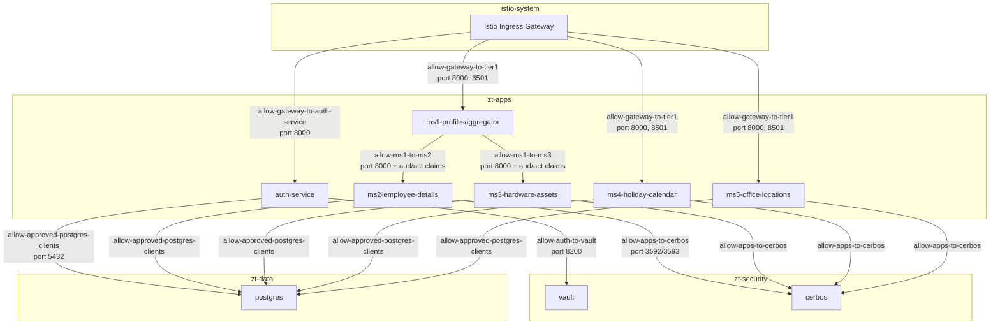
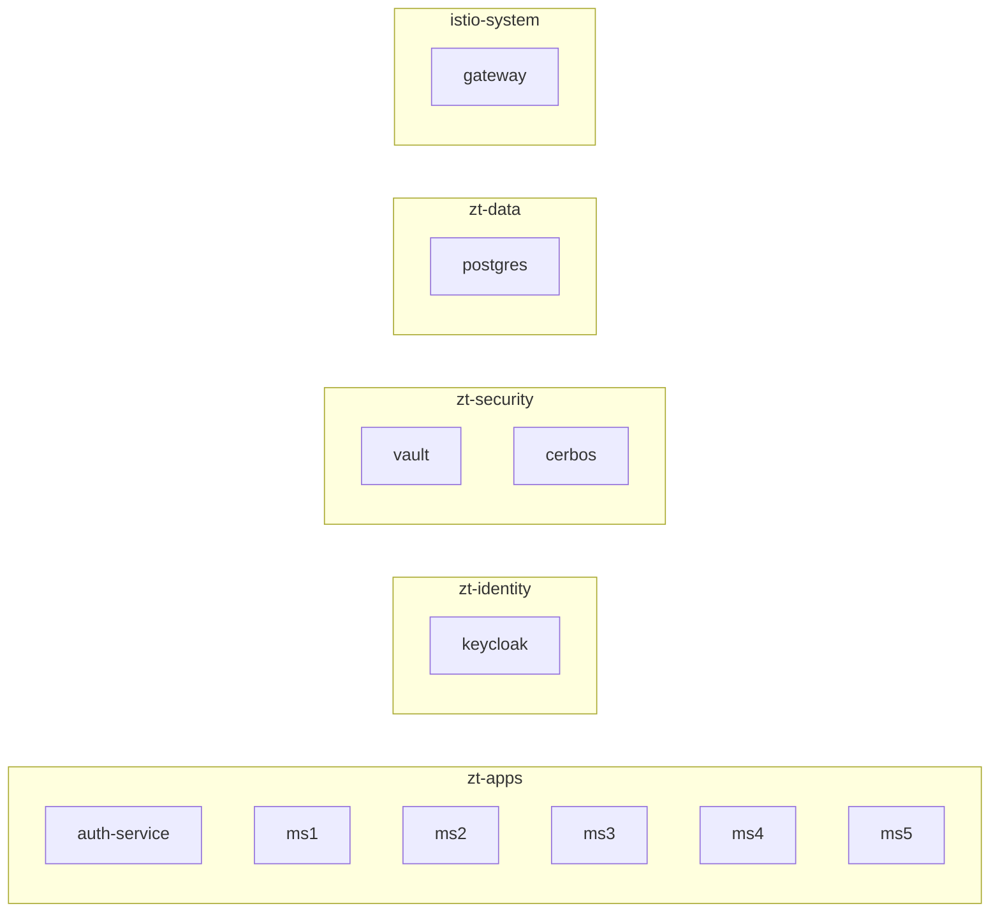

# Istio Network Security

Deep dive into mTLS enforcement, AuthorizationPolicies, and workload identity boundaries.

---

## Overview

Istio provides three network security primitives used in this architecture:

1. **PeerAuthentication** — Enforces mTLS between all pods (encryption + identity)
2. **AuthorizationPolicy** — Controls which workloads can talk to which (access control)
3. **RequestAuthentication** — Validates JWTs at the sidecar level (token verification)

Together they create a zero-trust network where every connection is authenticated, encrypted, and authorized at the infrastructure level — before application code runs.

---

## mTLS (PeerAuthentication)

### Configuration

Every namespace has STRICT mTLS:

```yaml
apiVersion: security.istio.io/v1beta1
kind: PeerAuthentication
metadata:
  name: strict-mtls
  namespace: zt-apps  # (also zt-data, zt-security, zt-identity)
spec:
  mtls:
    mode: STRICT
```

### What STRICT mode means

| Connection type | Behavior |
|----------------|----------|
| Pod-to-pod within mesh | mTLS required. Plaintext rejected. |
| External-to-gateway | TLS terminated at gateway (not mTLS — browsers can't do client certs) |
| Gateway-to-pod | mTLS between gateway's Envoy and pod's sidecar |
| Pod-to-external | Passes through (originate TLS if configured) |

### SPIFFE Identity

Every workload gets a SPIFFE identity derived from its Kubernetes service account:

```
spiffe://cluster.local/ns/{namespace}/sa/{service-account}
```

Examples:
- `spiffe://cluster.local/ns/zt-apps/sa/ms1-profile-aggregator-sa`
- `spiffe://cluster.local/ns/zt-apps/sa/auth-service-sa`
- `spiffe://cluster.local/ns/istio-system/sa/istio-ingressgateway-service-account`

These identities are cryptographically proven through X.509 certificates issued by Istio's CA (istiod). A pod cannot impersonate another pod's identity.

---

## AuthorizationPolicies

### Policy Map



### Detailed Policy Breakdown

#### Gateway → auth-service

```yaml
selector:
  matchLabels:
    app: auth-service
rules:
  - from:
      - source:
          principals: [cluster.local/ns/istio-system/sa/istio-ingressgateway-service-account]
    to:
      - operation:
          ports: ["8000"]
  - from:
      - source:
          namespaces: ["zt-apps"]
    to:
      - operation:
          ports: ["8000"]
          paths: ["/auth/jwks"]
```

Two rules:
1. Gateway can reach auth-service on port 8000 (for ExtAuthz and direct routes).
2. Any workload in `zt-apps` can fetch `/auth/jwks` (for JWKS validation by sidecars).

#### Gateway → Tier 1 services

```yaml
selector:
  matchLabels:
    tier: tier1
rules:
  - from:
      - source:
          principals: [cluster.local/ns/istio-system/sa/istio-ingressgateway-service-account]
    to:
      - operation:
          ports: ["8000", "8501"]
```

Only the gateway can reach Tier 1 services. No other in-cluster workload can call them (except via the defined service-to-service policies).

#### MS1 → MS2 (with claim enforcement)

```yaml
selector:
  matchLabels:
    app: ms2-employee-details
rules:
  - from:
      - source:
          principals: [cluster.local/ns/zt-apps/sa/ms1-profile-aggregator-sa]
    to:
      - operation:
          ports: ["8000"]
    when:
      - key: request.auth.claims[aud]
        values: ["ms2-employee-details"]
      - key: request.auth.claims[act][sub]
        values: ["ms1-profile-aggregator"]
```

This is the most restrictive policy. Three conditions must ALL pass:
1. **Source principal**: The calling pod's SPIFFE identity must be ms1's service account.
2. **Audience claim**: The JWT in x-mesh-identity must list ms2 in its audience.
3. **Actor claim**: The delegation context must show ms1 as the acting party.

This prevents:
- Any other pod impersonating ms1 (fails condition 1)
- ms1 forwarding a token meant for ms4 to ms2 (fails condition 2)
- A token without proper delegation context (fails condition 3)

#### Apps → Cerbos

```yaml
selector:
  matchLabels:
    app: cerbos
rules:
  - from:
      - source:
          principals:
            - cluster.local/ns/zt-apps/sa/ms2-employee-details-sa
            - cluster.local/ns/zt-apps/sa/ms3-hardware-assets-sa
            - cluster.local/ns/zt-apps/sa/ms4-holiday-calendar-sa
            - cluster.local/ns/zt-apps/sa/ms5-office-locations-sa
```

Only the four domain services that need authorization decisions can reach Cerbos. auth-service and ms1 cannot — they don't need fine-grained authorization.

#### Apps → PostgreSQL

```yaml
selector:
  matchLabels:
    app: postgres
rules:
  - from:
      - source:
          principals:
            - cluster.local/ns/zt-apps/sa/auth-service-sa
            - cluster.local/ns/zt-apps/sa/ms2-employee-details-sa
            - cluster.local/ns/zt-apps/sa/ms3-hardware-assets-sa
            - cluster.local/ns/zt-apps/sa/ms4-holiday-calendar-sa
            - cluster.local/ns/zt-apps/sa/ms5-office-locations-sa
            - cluster.local/ns/zt-apps/sa/db-seeder-sa
            - cluster.local/ns/zt-data/sa/postgres-migration-sa
```

Explicit allowlist for database access. Notably **ms1-profile-aggregator is NOT in this list** — it cannot connect to the database, even accidentally.

---

## What Gets Denied (Implicit Deny)

Istio's default with ALLOW policies is: if no ALLOW rule matches, the request is denied. This means:

| Attempt | Result | Why |
|---------|--------|-----|
| ms4 → ms2 | DENIED | ms4 is not in allow-ms1-to-ms2 source principals |
| Debug pod → ms2 | DENIED | No policy allows arbitrary pods to reach ms2 |
| ms1 → postgres | DENIED | ms1-sa is not in allow-approved-postgres-clients |
| ms2 → vault | DENIED | ms2-sa is not in allow-auth-to-vault |
| External → ms2 (bypass gateway) | DENIED | Pod has no publicly routed path + policy only allows ms1 |
| ms1 → ms2 with wrong aud | DENIED | AuthorizationPolicy `when` condition fails |

---

## Namespace Isolation



Namespaces serve as organizational units. The actual security boundary is the AuthorizationPolicy — not the namespace. But namespaces provide:
- Blast radius containment for RBAC (Kubernetes RBAC is namespace-scoped)
- Logical grouping for PeerAuthentication
- Clear separation of concerns in manifests

---

## Gateway ExtAuthz Configuration

The ExtAuthz provider is defined in the Istio mesh config:

```yaml
meshConfig:
  extensionProviders:
    - name: "auth-service-extauthz"
      envoyExtAuthzHttp:
        service: "auth-service.zt-apps.svc.cluster.local"
        port: 8000
        pathPrefix: "/verify"
        includeRequestHeadersInCheck:
          - "cookie"
          - "authorization"
          - "x-request-id"
        headersToUpstreamOnAllow:
          - "x-mesh-identity"
```

Key configuration:
- `pathPrefix: "/verify"` — the original request path is appended (e.g., `/verify/api/profile/123`)
- Only `cookie`, `authorization`, and `x-request-id` are forwarded to auth-service (not the full request headers)
- On ALLOW, only `x-mesh-identity` from auth-service's response is injected upstream

The ExtAuthz policy applies selectively:

```yaml
action: CUSTOM
provider:
  name: auth-service-extauthz
rules:
  - to:
      - operation:
          paths: ["/api/*"]
          notPaths: ["/api/offices", "/api/offices/*"]
```

This means:
- All `/api/*` paths require ExtAuthz **except** `/api/offices*`
- Office location traffic (reads and writes) bypasses the auth edge; ms5 enforces access via Cerbos and application-level role checks

---

## Port Restrictions

Every AuthorizationPolicy specifies the allowed port:

| Service | Allowed Port | Protocol |
|---------|-------------|----------|
| auth-service | 8000 | HTTP (FastAPI) |
| ms1-ms5 | 8000 | HTTP (FastAPI) |
| cerbos | 3592, 3593 | HTTP + gRPC |
| vault | 8200 | HTTP |
| postgres | 5432 | TCP (PostgreSQL wire) |

This prevents services from accidentally exposing debug ports, admin interfaces, or metrics that bypass application-level auth.
