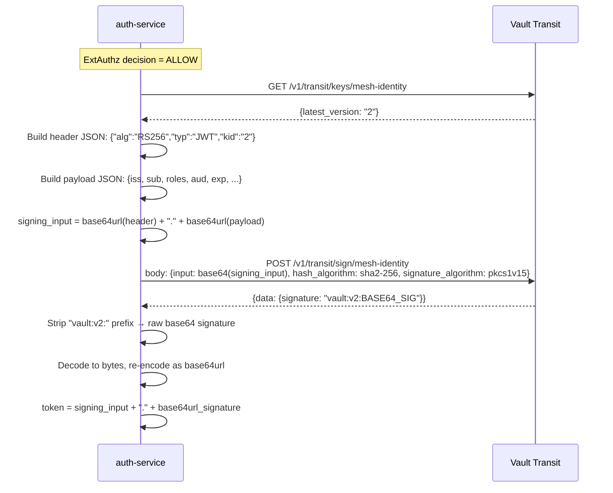
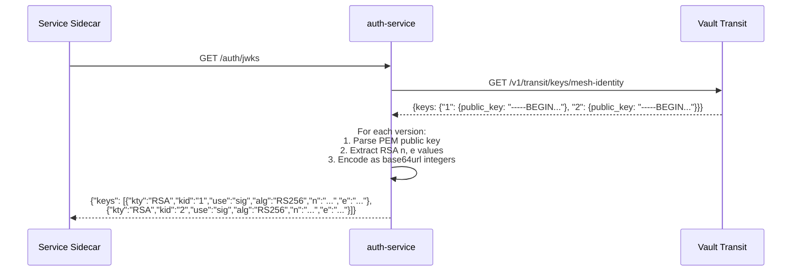

# Mesh Token & Cryptographic Identity

Deep dive into how internal identity assertions are created, signed, verified, and rotated using Vault Transit.

---

## What is `x-mesh-identity`?

A short-lived RS256 JWT that represents an authenticated user's identity within the mesh. It is:
- Created by auth-service on every successful ExtAuthz evaluation
- Signed by Vault Transit (auth-service never holds the private key)
- Injected into the upstream request by the ExtAuthz response
- Validated by each receiving service's Envoy sidecar
- Used to project per-service legacy headers

---

## Token Structure

### Header

```json
{
  "alg": "RS256",
  "typ": "JWT",
  "kid": "2"
}
```

- `kid`: Vault Transit key version. Used by verifiers to select the correct public key from JWKS.

### Payload

```json
{
  "iss": "auth-service",
  "sub": "550e8400-e29b-41d4-a716-446655440000",
  "preferred_username": "alice",
  "email": "alice@example.com",
  "roles": ["manager", "employee"],
  "roles_csv": "manager,employee",
  "groups": ["engineering"],
  "department": "Engineering",
  "aud": ["ms1-profile-aggregator", "ms2-employee-details", "ms3-hardware-assets"],
  "azp": "auth-service",
  "act": {"sub": "ms1-profile-aggregator"},
  "iat": 1716000000,
  "exp": 1716000300,
  "jti": "7f3b2c1d-4e5f-6a7b-8c9d-0e1f2a3b4c5d",
  "request_id": "req-abc-123"
}
```

### Claim Purposes

| Claim | Purpose | Who checks it |
|-------|---------|---------------|
| `iss` | Identifies the minting service | RequestAuthentication (sidecar) |
| `sub` | The human user's identity | Projected into x-msN-user headers |
| `roles` | Array of Keycloak roles | Application logic via Cerbos |
| `roles_csv` | Comma-joined roles for header projection | Projected into x-msN-role headers |
| `aud` | Which services may accept this token | AuthorizationPolicy `when` condition |
| `act` | Delegation context (which intermediary is calling) | AuthorizationPolicy `when` condition |
| `exp` | Token expiry (iat + 5 minutes) | RequestAuthentication (sidecar) |
| `jti` | Unique token ID for audit/replay detection | Logged for correlation |
| `request_id` | End-to-end trace correlation | Logged for debugging |
| `kid` | (in header) Vault key version | JWKS key selection |

### Why `roles_csv`?

Istio's `outputClaimToHeaders` cannot serialize JSON arrays into a header value. The `roles_csv` claim provides a pre-formatted string that can be directly projected into `x-msN-role` without parsing on the sidecar side.

---

## Token Minting Process



### Key Implementation Details

1. **base64url encoding**: Standard JWT requirement — uses URL-safe base64 with no padding (`=` stripped). Vault returns standard base64, so it must be re-encoded.

2. **Signing algorithm**: PKCS#1 v1.5 with SHA-256 (RS256). This matches the `alg` claim in the header.

3. **Vault signature format**: `vault:v{version}:{base64_signature}`. The version prefix is stripped; only the raw signature bytes are used in the JWT.

4. **None values excluded**: Any claim with a `None` value is dropped from the payload before serialization. This keeps tokens compact.

---

## Vault Transit Integration

### Key Setup

The Vault Transit engine has a key named `mesh-identity`:
- Type: RSA-2048 (supports RS256 signing)
- Supports versioned rotation
- Private key never leaves Vault's memory
- Public keys are exposed via the keys API

### Vault Client Operations

auth-service performs three Vault operations:

| Operation | Endpoint | When |
|-----------|----------|------|
| Get latest key version | `GET /v1/transit/keys/mesh-identity` | Every ExtAuthz ALLOW (to set `kid`) |
| Sign payload | `POST /v1/transit/sign/mesh-identity` | Every ExtAuthz ALLOW |
| Get all public keys | `GET /v1/transit/keys/mesh-identity` | Every JWKS request |

### Authentication

auth-service authenticates to Vault with a static token (`X-Vault-Token` header). This token is injected via environment variable.

---

## JWKS Publication

auth-service exposes `GET /auth/jwks` which returns all active Vault Transit public keys in JWK format.

### Flow



### JWKS Response Format

```json
{
  "keys": [
    {
      "kty": "RSA",
      "kid": "1",
      "use": "sig",
      "alg": "RS256",
      "n": "<base64url-encoded modulus>",
      "e": "<base64url-encoded exponent>"
    },
    {
      "kty": "RSA",
      "kid": "2",
      "use": "sig",
      "alg": "RS256",
      "n": "<base64url-encoded modulus>",
      "e": "<base64url-encoded exponent>"
    }
  ]
}
```

Key properties:
- All versions are served (not just the latest) — enables graceful rotation.
- The `kid` matches the Vault key version number.
- Sidecars cache this response and refresh periodically (Istio default: ~5 minutes).

---

## Token Verification (Sidecar Side)

Verification happens at the Envoy sidecar level via Istio's `RequestAuthentication`:

```yaml
jwtRules:
  - issuer: "auth-service"
    jwksUri: "http://auth-service.zt-apps.svc.cluster.local:8000/auth/jwks"
    fromHeaders:
      - name: "x-mesh-identity"
    outputClaimToHeaders:
      - header: "x-ms2-user"
        claim: "sub"
      - header: "x-ms2-role"
        claim: "roles_csv"
```

### What the sidecar checks:
1. Extract JWT from `x-mesh-identity` header
2. Parse the header to get `kid`
3. Look up the public key from cached JWKS by `kid`
4. Verify RS256 signature
5. Check `iss` == "auth-service"
6. Check `exp` > current time
7. If all pass: project configured claims into headers

### What the sidecar does NOT check:
- `aud` and `act` claims — these are checked by `AuthorizationPolicy` `when` conditions, not by RequestAuthentication.

---

## Key Rotation

### Rotation Procedure

```bash
# Rotate the key (creates a new version, old versions remain for verification)
vault write -f transit/keys/mesh-identity/rotate
```

### What Happens After Rotation

| Timeframe | State |
|-----------|-------|
| T+0 | New key version exists. auth-service's next `get_latest_key_version()` returns the new version. |
| T+0 to T+5min | Mix of old and new tokens in flight. JWKS serves both public keys. |
| T+5min | All old tokens have expired naturally (5-min TTL). |
| T+5min+ | Only new-version tokens exist in the mesh. Old public key can be pruned from Vault if desired. |

### Graceful Rotation Guarantee

The design ensures zero-downtime rotation because:
1. JWKS always serves ALL key versions (old + new)
2. Tokens are short-lived (5 minutes) — old tokens expire quickly
3. `kid` in each token tells the verifier which key to use
4. No coordinated restart needed — sidecars refresh JWKS on their own schedule

### Failure During Rotation Window

If a sidecar's JWKS cache hasn't refreshed and it receives a token with a new `kid`:
- The sidecar won't find a matching key → rejects the token → 403
- This is transient — next JWKS refresh resolves it
- The window is bounded by Istio's JWKS cache TTL (configurable, default ~5 min)
- For the POC with 5-min token TTL and 5-min JWKS cache, worst case is one failed request during the refresh window

---

## Security Properties

| Property | How it's achieved |
|----------|-------------------|
| Private key isolation | Vault Transit — key never leaves Vault |
| Replay resistance | 5-minute TTL + unique `jti` per token |
| Audience restriction | `aud` claim enforced by AuthorizationPolicy |
| Delegation tracking | `act` claim proves which intermediary forwarded the request |
| Non-forgeability | RS256 signature — only Vault can produce valid signatures |
| Rotation without downtime | Versioned keys + JWKS serves all versions |
| Audit correlation | `jti` and `request_id` in every token |
