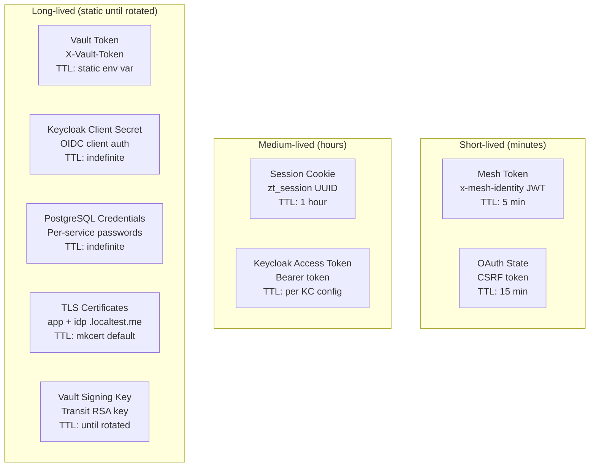

# Secret & Credential Lifecycle

Every secret in the system: what it protects, its TTL, rotation mechanism, and blast radius if compromised.

---

## Secret Inventory

---

## 1. Mesh Token (`x-mesh-identity`)

| Property | Value |
|----------|-------|
| **What** | RS256 JWT carrying user identity within the mesh |
| **Created by** | auth-service (on every ExtAuthz ALLOW) |
| **TTL** | 5 minutes (`MESH_TOKEN_EXPIRY_MINUTES`) |
| **Storage** | Never stored — exists only in HTTP headers in flight |
| **Rotation** | Not applicable (ephemeral per-request) |
| **Compromise blast radius** | Attacker can impersonate user for 5 minutes IF they can also satisfy mTLS source principal checks. Limited to the audience services listed in `aud`. |
| **Recovery** | Token expires naturally. Rotate Vault signing key to invalidate all outstanding tokens immediately. |

### Why 5 minutes?
Short enough that a leaked token (e.g., from a log) becomes useless quickly. Long enough to survive the round-trip through ms1→ms2/ms3 without expiring mid-request.

---

## 2. OAuth State Token

| Property | Value |
|----------|-------|
| **What** | `secrets.token_urlsafe(32)` — CSRF protection for OIDC flow |
| **Created by** | auth-service at login initiation |
| **TTL** | 15 minutes |
| **Storage** | SHA-256 hash in `auth.oauth_states` table. Raw value only in browser redirect URL. |
| **Rotation** | N/A (single-use, consumed on callback) |
| **Compromise blast radius** | Attacker could complete an OIDC flow on behalf of a user (session fixation). Requires intercepting the redirect. |
| **Recovery** | Single-use (consumed_at set atomically). Old states auto-expire. |

---

## 3. Session Cookie (`zt_session`)

| Property | Value |
|----------|-------|
| **What** | UUID4 referencing a row in `auth.sessions` |
| **Created by** | auth-service after successful OIDC callback |
| **TTL** | 1 hour (cookie `max_age` + DB `expires_at`) |
| **Storage** | Cookie in browser + row in PostgreSQL |
| **Rotation** | No sliding window — fixed 1 hour from creation |
| **Compromise blast radius** | Full account access for the session duration. Cookie is HttpOnly+Secure+SameSite, limiting theft vectors. |
| **Recovery** | `revoke_session()` → immediate invalidation. Or delete the DB row. |

### Cookie Security Flags

| Flag | Protection |
|------|-----------|
| `HttpOnly` | No JavaScript access (XSS can't steal it) |
| `Secure` | Only sent over HTTPS |
| `SameSite=lax` | Not sent on cross-origin POST (CSRF protection) |
| `path=/` | Scoped to the entire app domain |

---

## 4. Keycloak Access Token (Bearer)

| Property | Value |
|----------|-------|
| **What** | Keycloak-issued JWT used by API clients |
| **Created by** | Keycloak (via password grant, device flow, or code exchange) |
| **TTL** | Configured in Keycloak (typically 5-30 minutes) |
| **Storage** | Client-side (curl, API consumer). Never stored by auth-service. |
| **Rotation** | Refresh token flow (if configured) |
| **Compromise blast radius** | Attacker can authenticate as the user via ExtAuthz for the token's lifetime. |
| **Recovery** | Revoke in Keycloak admin. Short TTL limits exposure. |

---

## 5. Vault Access Token

| Property | Value |
|----------|-------|
| **What** | Static token for auth-service to call Vault Transit API |
| **Created by** | Vault bootstrap job during cluster setup |
| **TTL** | **Indefinite** (static env var, no renewal logic) |
| **Storage** | Kubernetes Secret → environment variable in auth-service pod |
| **Rotation** | Manual: create new token, update secret, restart pod |
| **Compromise blast radius** | **Critical.** Attacker can sign arbitrary mesh tokens. Combined with knowledge of the JWT structure, they can forge identity for any user/audience. |
| **Recovery** | Revoke token in Vault immediately. Create new token. Rotate Vault signing key. |

### Current limitation (POC)
No automatic renewal. If the token expires (if Vault is configured with TTLs), auth-service silently fails to mint mesh tokens → all protected requests 500.

### Production evolution
Use Vault Kubernetes auth method: the pod authenticates to Vault using its service account JWT, receives a short-lived token, and renews it automatically. No static secrets needed.

---

## 6. Keycloak Client Secret

| Property | Value |
|----------|-------|
| **What** | OIDC client secret for auth-service to exchange codes and validate tokens |
| **Created by** | Keycloak realm configuration |
| **TTL** | Indefinite (until regenerated in Keycloak) |
| **Storage** | Kubernetes Secret → environment variable |
| **Rotation** | Manual: regenerate in Keycloak admin, update K8s secret, restart pod |
| **Compromise blast radius** | Attacker can exchange authorization codes intended for auth-service. Requires also having a valid authorization code (from intercepting a redirect). |
| **Recovery** | Regenerate client secret in Keycloak. |

---

## 7. PostgreSQL Credentials

| Property | Value |
|----------|-------|
| **What** | Per-service database username/password pairs |
| **Created by** | Migration script (`003_runtime_roles.sql`) |
| **TTL** | Indefinite |
| **Storage** | Kubernetes Secrets → environment variables (DATABASE_URL) |
| **Rotation** | Manual: ALTER USER, update K8s secrets, restart pods |
| **Compromise blast radius** | Limited by PostgreSQL GRANT + RLS. e.g., `ms2_app` credential compromise gives access to `hr` schema only, still subject to RLS. |
| **Recovery** | Change password, restart affected service. |

### Current service credentials

| User | Password (POC default) | Role | Schema Access |
|------|----------------------|------|---------------|
| `auth_service_app` | `auth_pass` | auth_service_role | auth |
| `ms2_app` | `ms2_pass` | ms2_hr_role | hr |
| `ms3_app` | `ms3_pass` | ms3_it_role | it |
| `ms4_app` | `ms4_pass` | ms4_public_readwrite_role | public_data |
| `ms5_app` | `ms5_pass` | ms5_public_readwrite_role | public_data |

These are POC defaults — in production, use generated secrets injected via Vault dynamic database credentials or sealed secrets.

---

## 8. Vault Transit Signing Key

| Property | Value |
|----------|-------|
| **What** | RSA-2048 asymmetric key pair for signing mesh tokens |
| **Created by** | Vault bootstrap job (`transit/keys/mesh-identity`) |
| **TTL** | Indefinite (versioned, old versions kept for verification) |
| **Storage** | Vault Transit engine (private key never leaves Vault memory) |
| **Rotation** | `./scripts/rotate-vault-key.sh` (rotates key + bumps `min_decryption_version`) |
| **Compromise blast radius** | **Catastrophic if private key extracted** — but private key CANNOT be extracted from Transit. If Vault itself is compromised, attacker could sign tokens. |
| **Recovery** | `./scripts/rotate-vault-key.sh` → new version + old keys invalidated. In-flight tokens expire in 5 min. Rotate Vault root token. |

### Key rotation impact
- Zero downtime — new tokens use new version immediately
- Old key versions removed from JWKS after `min_decryption_version` bump
- In-flight tokens signed with old key expire within 5 min (token TTL)
- Istio sidecars refresh JWKS within 20 min (default cache TTL)
- Use `--grace` flag on rotation script to wait for token expiry before invalidating old key
- No coordinated restart needed

---

## 9. TLS Certificates

| Property | Value |
|----------|-------|
| **What** | TLS certs for `app.localtest.me` and `idp.localtest.me` (active). `portal.localtest.me` is also generated by `create-local-certs.sh` but is unused in the current UI flow. |
| **Created by** | `mkcert` via `scripts/create-local-certs.sh` |
| **Trust mechanism** | `mkcert -install` adds a local CA to the system trust store (and NSS for Firefox). Browsers and Python (`requests`/`certifi`) trust the certs natively — no `verify=False` or `--insecure` needed. |
| **TTL** | mkcert default (typically 2 years + 3 months) |
| **Storage** | `app` and `idp` certs: Kubernetes TLS secrets in `istio-system` and `.local/certs/` on disk. Streamlit (`run-ui.sh`) reuses the `app.localtest.me` cert pair for HTTPS on port 8501. |
| **Rotation** | Regenerate via `./scripts/create-local-certs.sh` + update K8s secrets via `./scripts/create-kind-cluster.sh` |
| **Compromise blast radius** | MITM on local traffic. In POC context: minimal (localhost only). |

---

## Rotation Procedures Summary

| Secret | Rotation Complexity | Downtime | Automation in POC |
|--------|-------------------|----------|-------------------|
| Mesh tokens | Automatic (5-min expiry) | None | Built-in |
| OAuth state | Automatic (15-min expiry) | None | Built-in |
| Sessions | Automatic (1-hour expiry) | None | Built-in |
| Vault signing key | One command (`./scripts/rotate-vault-key.sh`) | None (graceful) | Manual (script provided) |
| Vault access token | Create + update + restart | Brief (pod restart) | None |
| Keycloak client secret | Regenerate + update + restart | Brief | None |
| PostgreSQL credentials | ALTER USER + update + restart | Brief | None |
| TLS certificates | Regenerate + update secret | None (if Envoy picks up) | None |

---

## Threat Scenarios by Secret

| Compromised Secret | Can the attacker... | Limited by... |
|-------------------|---------------------|---------------|
| Mesh token (one) | Impersonate user for 5 min | mTLS source principal check, token audience |
| Session cookie | Access user's account | 1-hour expiry, revocation available |
| Vault token | Forge mesh tokens for ANY user | Would need to know JWT structure + valid audience values |
| Keycloak client secret | Exchange intercepted auth codes | Needs valid code (from redirect interception) |
| PostgreSQL password (ms2) | Read/write HR schema | RLS still enforces row visibility (needs valid app context) |
| Vault signing key (impossible to extract) | N/A | Transit engine design prevents extraction |
