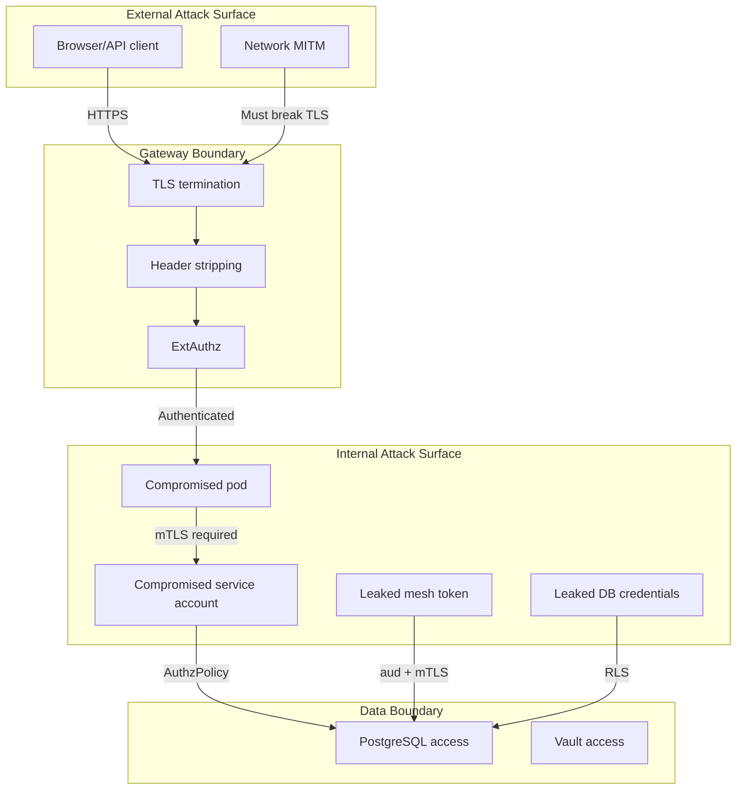
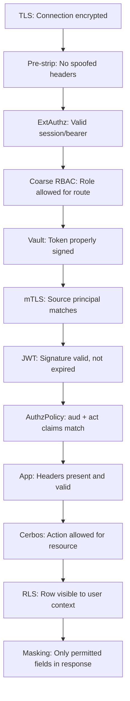

# Threat Model & Security Invariants

What each layer defends against, the residual risks, and the security invariants the system must maintain.

---

## Security Invariants

These properties must ALWAYS hold. If any is violated, the security model is broken:

1. **No external header injection**: Identity headers arriving from outside the cluster are stripped before reaching any service.
2. **No unsigned identity**: The only way to get a valid `x-mesh-identity` is through auth-service + Vault signing.
3. **No unauthorized lateral movement**: A service can only reach services explicitly listed in its AuthorizationPolicy.
4. **No audience confusion**: A mesh token minted for service A cannot be used at service B (aud check).
5. **No identity without authentication**: Every protected request requires either a valid session or a valid bearer token.
6. **No data without authorization**: Sensitive data queries go through RLS regardless of application logic.
7. **Fail closed**: Component failures deny access rather than bypassing checks.

---

## Attack Surface Map

---

## Threats and Mitigations

### 1. External Header Injection

**Attack**: Attacker sends `x-mesh-identity: forged-jwt` or `x-ms2-user: admin` from outside.

**Mitigation chain**:
| Layer | Defense |
|-------|---------|
| Gateway pre-strip | Lua filter removes all identity headers matching known patterns |
| ExtAuthz | Only auth-service can set x-mesh-identity (via response header) |
| Sidecar strip | Each pod's inbound Lua removes its specific legacy headers |
| Sidecar JWT validation | Forged x-mesh-identity fails signature check |

**Residual risk**: If the Lua pattern regex doesn't match a new header name (e.g., typo in service header), it could pass through. Mitigated by the fact that sidecars independently strip their own headers.

---

### 2. Session Hijacking (Cookie Theft)

**Attack**: Attacker steals the `zt_session` cookie via XSS or network sniffing.

**Mitigation**:
| Defense | How |
|---------|-----|
| HttpOnly | JavaScript cannot read the cookie |
| Secure | Not sent over plaintext HTTP |
| SameSite=lax | Not sent on cross-origin POST requests |
| TLS | Encrypted in transit |
| 1-hour TTL | Limited window of opportunity |
| Server-side revocation | Logout immediately invalidates |

**Residual risk**: If attacker has XSS AND a way to exfiltrate via a same-origin GET request (SameSite=lax allows same-origin navigation). This is a very constrained attack.

---

### 3. Bearer Token Replay

**Attack**: Attacker obtains a valid Keycloak access token (from logs, network capture, or social engineering).

**Mitigation**:
| Defense | How |
|---------|-----|
| Token TTL | Keycloak tokens have short lifetimes |
| TLS | Encrypted in transit, can't sniff |
| Mesh token audience | Even with a valid bearer, the resulting mesh token is scoped to specific services |
| mTLS | Mesh token from a rogue client fails source principal check |

**Residual risk**: Within the token's TTL, attacker can make authenticated requests. They get the same access level as the compromised user but only through the legitimate gateway path.

---

### 4. Compromised ms1 (Aggregator)

**Attack**: Attacker gains code execution on ms1-profile-aggregator.

**What they CAN do**:
- Forward valid mesh tokens to ms2/ms3 (but only with legitimate user tokens)
- Read responses from ms2/ms3 for authenticated users
- Access ms1's environment variables

**What they CANNOT do**:
- Reach PostgreSQL (ms1 is not in the DB AuthorizationPolicy)
- Reach Vault (only auth-service-sa is allowed)
- Forge mesh tokens (no Vault access)
- Reach ms4/ms5 (no AuthorizationPolicy allows ms1→ms4/ms5)
- Call ms2/ms3 without a valid mesh token (sidecar validates JWT)

**Recovery**: Rotate Vault signing key (invalidates all tokens in 5 min), restart ms1 pod.

---

### 5. Compromised ms2 (Data Service)

**Attack**: Attacker gains code execution on ms2-employee-details.

**What they CAN do**:
- Query the `hr` schema as `ms2_app` user
- Call Cerbos
- Read ms2's environment (DATABASE_URL with credentials)

**What they CANNOT do**:
- Bypass RLS (still needs valid `set_config` context to see protected rows)
- Access `auth`, `it`, or `public_data` schemas (GRANT restricts)
- Reach Vault (not in AuthorizationPolicy)
- Reach ms3, ms4, ms5 (no policies allow this)
- Forge mesh tokens

**Blast radius**: If the attacker can set arbitrary RLS context (they control the code), they can read all HR data. RLS with `USING (true)` on employees doesn't restrict reads. PII/financials tables have tighter policies.

**Residual risk**: The attacker effectively becomes hr_admin for reads. This is the acknowledged tradeoff of application-level RLS context setting.

---

### 6. Compromised auth-service

**Attack**: Attacker gains code execution on auth-service.

**What they CAN do**:
- Mint mesh tokens for any user with any roles/audience (via Vault)
- Read all sessions from the `auth` schema
- Impersonate any user
- Validate/reject any request

**What they CANNOT do**:
- Extract the Vault private signing key (Transit engine prevents this)
- Persist after Vault token rotation
- Access hr/it/public_data schemas directly

**Blast radius**: **Critical** — auth-service compromise = full identity compromise for the mesh token's validity window.

**Recovery**:
1. Rotate Vault access token (revoke old one)
2. Rotate Vault signing key
3. Purge all sessions from PostgreSQL
4. Rebuild auth-service pod from clean image

---

### 7. Stolen Mesh Token (Replay from Rogue Pod)

**Attack**: Attacker captures a valid `x-mesh-identity` (e.g., from pod logs) and replays it from a different pod.

**Mitigation**:
| Defense | How |
|---------|-----|
| mTLS source principal | Rogue pod has wrong SPIFFE identity → AuthorizationPolicy denies |
| 5-minute TTL | Token expires quickly even if the principal check could be bypassed |
| Audience restriction | Token is only accepted by specific target services |

**Residual risk**: If attacker compromises the exact pod that's allowed (e.g., gains shell on ms1 pod), they can use the token. But at that point, they already have access to what ms1 can do.

---

### 8. SQL Injection Through to PII

**Attack**: Application has a SQL injection vulnerability that allows arbitrary queries.

**Mitigation**:
| Defense | How |
|---------|-----|
| RLS | Even injected queries go through RLS evaluation |
| Schema isolation | ms2's connection can only access `hr` schema |
| Parameterized queries | SQLAlchemy uses parameterized queries by default |

**Residual risk**: If the attacker can execute `SELECT set_config('app.current_roles', 'hr_admin', true)` in the same transaction before the RLS-protected query, they bypass RLS. This requires injection in a way that allows multiple statements. SQLAlchemy's parameterized queries make this very difficult.

---

### 9. Vault Token Theft

**Attack**: Attacker obtains the VAULT_TOKEN environment variable.

**What they can do**: Sign arbitrary payloads, forge mesh tokens.

**Mitigation**:
| Defense | How |
|---------|-----|
| K8s RBAC | Only auth-service pod can read its secret |
| Namespace isolation | Secret is in zt-apps namespace |
| Network policy | Can only reach Vault from auth-service-sa |

**Critical note**: Even with the Vault token, the attacker needs to reach Vault's network endpoint. AuthorizationPolicy only allows `auth-service-sa` → Vault. But if the attacker IS on the auth-service pod, they already have full access (see threat #6).

---

### 10. Cross-Namespace Pod Escape

**Attack**: Container escape from a pod in `zt-apps` to the node, then pivot to pods in `zt-security` (Vault/Cerbos) or `zt-data` (PostgreSQL).

**Mitigation**:
| Defense | How |
|---------|-----|
| STRICT mTLS | Even node-level access can't bypass mTLS (no valid SPIFFE cert) |
| AuthorizationPolicy | Still enforced at the destination sidecar |
| Network-level isolation | Istio CNI can restrict raw network access |

**Residual risk**: In a `kind` cluster without network policies, node-level access might bypass Envoy by going directly to pod IPs on non-service ports. In production, this is mitigated by network policies and CNI-level enforcement.

---

## Defense-in-Depth Summary

For a request to successfully read sensitive data, ALL of these must be true:

Compromising any single layer is insufficient. An attacker must bypass or satisfy ALL layers simultaneously.

---

## What This Architecture Does NOT Protect Against

| Threat | Why not covered |
|--------|----------------|
| Insider with legitimate hr_admin credentials | They have authorized access — this is a policy/HR problem |
| Keycloak admin compromise | Full identity provider control = game over |
| Vault unseal key theft | Full Vault control = can extract keys |
| Kubernetes cluster admin | Can bypass everything (delete policies, read secrets) |
| Supply chain attack on base images | Not in scope for POC |
| Side-channel attacks | Not relevant for auth/authz architecture |
